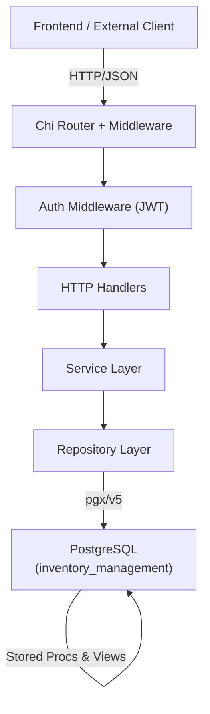
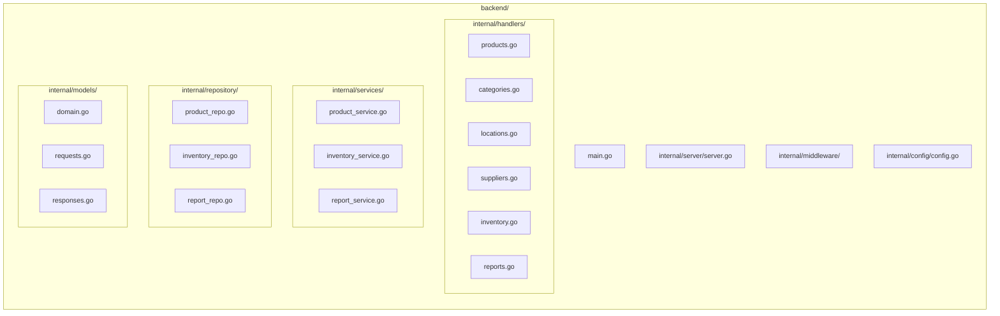
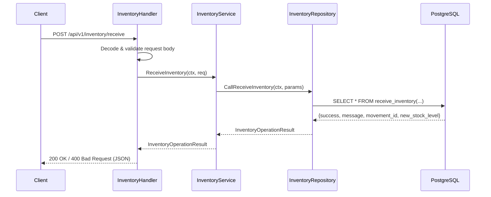
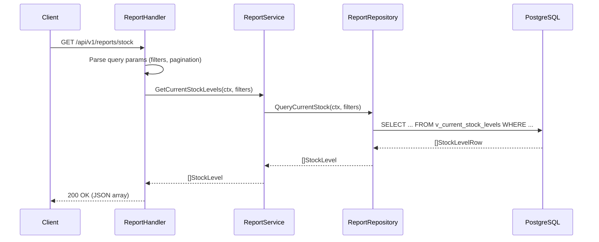

# Design Document: Inventory API

## Overview

A RESTful HTTP API written in Go that exposes the existing PostgreSQL inventory management database to frontend clients and external integrations. The API wraps the existing stored procedures (`receive_inventory`, `ship_inventory`, `transfer_inventory`, `adjust_inventory`), queries the reporting views, and provides full CRUD access to the core domain entities (products, categories, locations, suppliers). It is structured as a standard Go service living in `backend/` with a layered architecture: HTTP handlers → service layer → repository layer → PostgreSQL.

The API is designed to be stateless, horizontally scalable, and to treat the database as the source of truth — all business logic for stock mutations lives in the existing stored procedures and triggers, so the Go layer focuses on validation, serialization, authentication, and routing.

## Architecture





## Sequence Diagrams

### Receive Inventory Flow



### Stock Query Flow



## Components and Interfaces

### HTTP Server (`internal/server`)

**Purpose**: Bootstraps the Chi router, registers all routes, attaches middleware, and manages graceful shutdown.

**Interface**:
```go
type Server struct {
    router     *chi.Mux
    db         *pgxpool.Pool
    cfg        *config.Config
}

func New(cfg *config.Config, db *pgxpool.Pool) *Server
func (s *Server) Start() error
func (s *Server) registerRoutes()
```

**Responsibilities**:
- Mount versioned route groups under `/api/v1/`
- Attach middleware chain: RequestID → Logger → Recoverer → CORS → Auth
- Expose `/health` and `/metrics` endpoints without auth

---

### Handlers (`internal/handlers`)

**Purpose**: Decode HTTP requests, call the service layer, encode responses. No business logic.

```go
type ProductHandler struct{ svc services.ProductService }
type InventoryHandler struct{ svc services.InventoryService }
type ReportHandler struct{ svc services.ReportService }

// ProductHandler methods
func (h *ProductHandler) List(w http.ResponseWriter, r *http.Request)
func (h *ProductHandler) Get(w http.ResponseWriter, r *http.Request)
func (h *ProductHandler) Create(w http.ResponseWriter, r *http.Request)
func (h *ProductHandler) Update(w http.ResponseWriter, r *http.Request)
func (h *ProductHandler) Delete(w http.ResponseWriter, r *http.Request)

// InventoryHandler methods
func (h *InventoryHandler) Receive(w http.ResponseWriter, r *http.Request)
func (h *InventoryHandler) Ship(w http.ResponseWriter, r *http.Request)
func (h *InventoryHandler) Transfer(w http.ResponseWriter, r *http.Request)
func (h *InventoryHandler) Adjust(w http.ResponseWriter, r *http.Request)
func (h *InventoryHandler) ListMovements(w http.ResponseWriter, r *http.Request)

// ReportHandler methods
func (h *ReportHandler) CurrentStock(w http.ResponseWriter, r *http.Request)
func (h *ReportHandler) LowStockAlerts(w http.ResponseWriter, r *http.Request)
func (h *ReportHandler) ProductSummary(w http.ResponseWriter, r *http.Request)
func (h *ReportHandler) InventoryAging(w http.ResponseWriter, r *http.Request)
func (h *ReportHandler) SupplierPerformance(w http.ResponseWriter, r *http.Request)
func (h *ReportHandler) Valuation(w http.ResponseWriter, r *http.Request)
```

---

### Services (`internal/services`)

**Purpose**: Orchestrate business rules, coordinate repositories, enforce invariants that can't live in the DB.

```go
type ProductService interface {
    List(ctx context.Context, f ProductFilter) ([]models.Product, int, error)
    Get(ctx context.Context, id int) (*models.Product, error)
    Create(ctx context.Context, req models.CreateProductRequest) (*models.Product, error)
    Update(ctx context.Context, id int, req models.UpdateProductRequest) (*models.Product, error)
    Delete(ctx context.Context, id int) error
}

type InventoryService interface {
    Receive(ctx context.Context, req models.ReceiveRequest) (*models.OperationResult, error)
    Ship(ctx context.Context, req models.ShipRequest) (*models.OperationResult, error)
    Transfer(ctx context.Context, req models.TransferRequest) (*models.TransferResult, error)
    Adjust(ctx context.Context, req models.AdjustRequest) (*models.OperationResult, error)
    ListMovements(ctx context.Context, f MovementFilter) ([]models.Movement, int, error)
}

type ReportService interface {
    CurrentStock(ctx context.Context, f StockFilter) ([]models.StockLevel, int, error)
    LowStockAlerts(ctx context.Context) ([]models.LowStockAlert, error)
    ProductSummary(ctx context.Context, f ProductFilter) ([]models.ProductStockSummary, error)
    InventoryAging(ctx context.Context) ([]models.AgingRecord, error)
    SupplierPerformance(ctx context.Context) ([]models.SupplierPerformance, error)
    Valuation(ctx context.Context, method string, productID, locationID *int) ([]models.ValuationRecord, error)
}
```

---

### Repositories (`internal/repository`)

**Purpose**: All SQL — queries, stored procedure calls, view reads. Returns domain models.

```go
type ProductRepository interface {
    List(ctx context.Context, f ProductFilter) ([]models.Product, int, error)
    GetByID(ctx context.Context, id int) (*models.Product, error)
    GetBySKU(ctx context.Context, sku string) (*models.Product, error)
    Create(ctx context.Context, p models.Product) (*models.Product, error)
    Update(ctx context.Context, p models.Product) (*models.Product, error)
    Delete(ctx context.Context, id int) error
}

type InventoryRepository interface {
    CallReceive(ctx context.Context, p ReceiveParams) (*models.OperationResult, error)
    CallShip(ctx context.Context, p ShipParams) (*models.OperationResult, error)
    CallTransfer(ctx context.Context, p TransferParams) (*models.TransferResult, error)
    CallAdjust(ctx context.Context, p AdjustParams) (*models.OperationResult, error)
    ListMovements(ctx context.Context, f MovementFilter) ([]models.Movement, int, error)
}

type ReportRepository interface {
    CurrentStock(ctx context.Context, f StockFilter) ([]models.StockLevel, int, error)
    LowStockAlerts(ctx context.Context) ([]models.LowStockAlert, error)
    ProductSummary(ctx context.Context, f ProductFilter) ([]models.ProductStockSummary, error)
    InventoryAging(ctx context.Context) ([]models.AgingRecord, error)
    SupplierPerformance(ctx context.Context) ([]models.SupplierPerformance, error)
    ValuationAvg(ctx context.Context, productID, locationID *int) ([]models.ValuationRecord, error)
}
```

## Data Models

### Domain Models (`internal/models/domain.go`)

```go
type Product struct {
    ProductID      int        `json:"product_id"`
    SKU            string     `json:"sku"`
    Name           string     `json:"name"`
    Description    *string    `json:"description,omitempty"`
    CategoryID     *int       `json:"category_id,omitempty"`
    UnitOfMeasure  string     `json:"unit_of_measure"`
    WeightKg       *float64   `json:"weight_kg,omitempty"`
    CostPrice      *float64   `json:"cost_price,omitempty"`
    SellingPrice   *float64   `json:"selling_price,omitempty"`
    Status         string     `json:"status"` // active | discontinued | pending
    CreatedAt      time.Time  `json:"created_at"`
    UpdatedAt      time.Time  `json:"updated_at"`
}

type Category struct {
    CategoryID       int       `json:"category_id"`
    Name             string    `json:"name"`
    Description      *string   `json:"description,omitempty"`
    ParentCategoryID *int      `json:"parent_category_id,omitempty"`
    IsActive         bool      `json:"is_active"`
    CreatedAt        time.Time `json:"created_at"`
}

type Location struct {
    LocationID       int       `json:"location_id"`
    Code             string    `json:"code"`
    Name             string    `json:"name"`
    LocationType     string    `json:"location_type"`
    ParentLocationID *int      `json:"parent_location_id,omitempty"`
    Capacity         *int      `json:"capacity,omitempty"`
    IsActive         bool      `json:"is_active"`
    CreatedAt        time.Time `json:"created_at"`
}

type Supplier struct {
    SupplierID    int       `json:"supplier_id"`
    Code          string    `json:"code"`
    Name          string    `json:"name"`
    ContactPerson *string   `json:"contact_person,omitempty"`
    Email         *string   `json:"email,omitempty"`
    Phone         *string   `json:"phone,omitempty"`
    PaymentTerms  *string   `json:"payment_terms,omitempty"`
    IsActive      bool      `json:"is_active"`
    CreatedAt     time.Time `json:"created_at"`
}

type Movement struct {
    MovementID        int        `json:"movement_id"`
    ProductID         int        `json:"product_id"`
    LocationID        int        `json:"location_id"`
    MovementTypeID    int        `json:"movement_type_id"`
    Quantity          int        `json:"quantity"`
    UnitCost          *float64   `json:"unit_cost,omitempty"`
    ReferenceDocument *string    `json:"reference_document,omitempty"`
    Notes             *string    `json:"notes,omitempty"`
    CreatedBy         string     `json:"created_by"`
    CreatedAt         time.Time  `json:"created_at"`
}

type StockLevel struct {
    ProductID         int        `json:"product_id"`
    SKU               string     `json:"sku"`
    ProductName       string     `json:"product_name"`
    CategoryName      *string    `json:"category_name,omitempty"`
    LocationID        int        `json:"location_id"`
    LocationCode      string     `json:"location_code"`
    LocationName      string     `json:"location_name"`
    QuantityOnHand    int        `json:"quantity_on_hand"`
    QuantityReserved  int        `json:"quantity_reserved"`
    QuantityAvailable int        `json:"quantity_available"`
    LastMovementAt    *time.Time `json:"last_movement_at,omitempty"`
    InventoryValueCost *float64  `json:"inventory_value_cost,omitempty"`
}

type LowStockAlert struct {
    ProductID            int     `json:"product_id"`
    SKU                  string  `json:"sku"`
    ProductName          string  `json:"product_name"`
    LocationCode         string  `json:"location_code"`
    QuantityAvailable    int     `json:"quantity_available"`
    ReorderPoint         int     `json:"reorder_point"`
    UnitsBelowReorder    int     `json:"units_below_reorder"`
    StockStatus          string  `json:"stock_status"` // OUT_OF_STOCK | CRITICAL | LOW
    PreferredSupplier    *string `json:"preferred_supplier,omitempty"`
    LeadTimeDays         *int    `json:"lead_time_days,omitempty"`
}

type OperationResult struct {
    Success       bool   `json:"success"`
    Message       string `json:"message"`
    MovementID    *int   `json:"movement_id,omitempty"`
    NewStockLevel *int   `json:"new_stock_level,omitempty"`
}

type TransferResult struct {
    Success        bool   `json:"success"`
    Message        string `json:"message"`
    MovementOutID  *int   `json:"movement_out_id,omitempty"`
    MovementInID   *int   `json:"movement_in_id,omitempty"`
    FromStockLevel *int   `json:"from_stock_level,omitempty"`
    ToStockLevel   *int   `json:"to_stock_level,omitempty"`
}
```

### Request Models (`internal/models/requests.go`)

```go
type CreateProductRequest struct {
    SKU           string   `json:"sku" validate:"required,min=1,max=50"`
    Name          string   `json:"name" validate:"required,min=1,max=200"`
    Description   *string  `json:"description"`
    CategoryID    *int     `json:"category_id"`
    UnitOfMeasure string   `json:"unit_of_measure" validate:"required"`
    CostPrice     *float64 `json:"cost_price" validate:"omitempty,min=0"`
    SellingPrice  *float64 `json:"selling_price" validate:"omitempty,min=0"`
    Status        string   `json:"status" validate:"omitempty,oneof=active discontinued pending"`
}

type ReceiveRequest struct {
    ProductID         int      `json:"product_id" validate:"required,min=1"`
    LocationID        int      `json:"location_id" validate:"required,min=1"`
    Quantity          int      `json:"quantity" validate:"required,min=1"`
    UnitCost          float64  `json:"unit_cost" validate:"min=0"`
    ReferenceDocument *string  `json:"reference_document"`
    Notes             *string  `json:"notes"`
}

type ShipRequest struct {
    ProductID         int      `json:"product_id" validate:"required,min=1"`
    LocationID        int      `json:"location_id" validate:"required,min=1"`
    Quantity          int      `json:"quantity" validate:"required,min=1"`
    UnitCost          float64  `json:"unit_cost" validate:"min=0"`
    ReferenceDocument *string  `json:"reference_document"`
    Notes             *string  `json:"notes"`
}

type TransferRequest struct {
    ProductID         int      `json:"product_id" validate:"required,min=1"`
    FromLocationID    int      `json:"from_location_id" validate:"required,min=1"`
    ToLocationID      int      `json:"to_location_id" validate:"required,min=1"`
    Quantity          int      `json:"quantity" validate:"required,min=1"`
    UnitCost          float64  `json:"unit_cost" validate:"min=0"`
    ReferenceDocument *string  `json:"reference_document"`
    Notes             *string  `json:"notes"`
}

type AdjustRequest struct {
    ProductID         int     `json:"product_id" validate:"required,min=1"`
    LocationID        int     `json:"location_id" validate:"required,min=1"`
    AdjustmentQty     int     `json:"adjustment_quantity" validate:"required,ne=0"`
    Reason            string  `json:"reason" validate:"required,min=1"`
    ReferenceDocument *string `json:"reference_document"`
}
```

**Validation Rules**:
- SKU: non-empty, max 50 chars, unique in DB
- Quantity for receive/ship/transfer: must be > 0
- AdjustmentQty: must be non-zero (positive or negative)
- UnitCost: must be >= 0
- Status: one of `active`, `discontinued`, `pending`
- `from_location_id` != `to_location_id` for transfers (enforced in service layer)

## API Endpoints

### Base URL: `/api/v1`

#### Products

| Method | Path | Description |
|--------|------|-------------|
| GET | `/products` | List products (paginated, filterable by status, category) |
| GET | `/products/{id}` | Get product by ID |
| GET | `/products/sku/{sku}` | Get product by SKU |
| POST | `/products` | Create product |
| PUT | `/products/{id}` | Update product |
| DELETE | `/products/{id}` | Soft-delete (set status=discontinued) |

#### Categories

| Method | Path | Description |
|--------|------|-------------|
| GET | `/categories` | List all categories |
| GET | `/categories/{id}` | Get category by ID |
| POST | `/categories` | Create category |
| PUT | `/categories/{id}` | Update category |

#### Locations

| Method | Path | Description |
|--------|------|-------------|
| GET | `/locations` | List locations (filterable by type, active) |
| GET | `/locations/{id}` | Get location by ID |
| POST | `/locations` | Create location |
| PUT | `/locations/{id}` | Update location |

#### Suppliers

| Method | Path | Description |
|--------|------|-------------|
| GET | `/suppliers` | List suppliers |
| GET | `/suppliers/{id}` | Get supplier by ID |
| POST | `/suppliers` | Create supplier |
| PUT | `/suppliers/{id}` | Update supplier |

#### Inventory Operations

| Method | Path | Description |
|--------|------|-------------|
| POST | `/inventory/receive` | Receive stock (calls `receive_inventory()`) |
| POST | `/inventory/ship` | Ship stock (calls `ship_inventory()`) |
| POST | `/inventory/transfer` | Transfer between locations (calls `transfer_inventory()`) |
| POST | `/inventory/adjust` | Adjust stock count (calls `adjust_inventory()`) |
| GET | `/inventory/movements` | List movements (paginated, filterable by product/location/type/date) |
| GET | `/inventory/movements/{id}` | Get single movement |

#### Reports

| Method | Path | Description |
|--------|------|-------------|
| GET | `/reports/stock` | Current stock levels (`v_current_stock_levels`) |
| GET | `/reports/stock/summary` | Product stock summary (`v_product_stock_summary`) |
| GET | `/reports/stock/alerts` | Low stock alerts (`v_low_stock_alerts`) |
| GET | `/reports/stock/aging` | Inventory aging (`v_inventory_aging`) |
| GET | `/reports/valuation` | Inventory valuation (`?method=avg`) |
| GET | `/reports/turnover` | Inventory turnover (`calculate_inventory_turnover()`) |
| GET | `/reports/suppliers/performance` | Supplier performance (`v_supplier_performance`) |
| GET | `/reports/movements/recent` | Recent movements (`v_recent_movements`) |

#### System

| Method | Path | Description |
|--------|------|-------------|
| GET | `/health` | Health check (DB ping) |

### Query Parameters (common)

- `page` (int, default 1), `page_size` (int, default 50, max 200)
- `product_id`, `location_id`, `category_id`, `supplier_id` — integer filters
- `status` — string filter
- `from_date`, `to_date` — ISO 8601 date filters for movements

### Response Envelope

All responses use a consistent envelope:

```go
type Response struct {
    Data    any    `json:"data"`
    Error   string `json:"error,omitempty"`
}

type PaginatedResponse struct {
    Data       any `json:"data"`
    Total      int `json:"total"`
    Page       int `json:"page"`
    PageSize   int `json:"page_size"`
    TotalPages int `json:"total_pages"`
}
```

HTTP status codes:
- `200 OK` — successful read or operation
- `201 Created` — successful resource creation
- `400 Bad Request` — validation failure or DB procedure returned `success=false`
- `401 Unauthorized` — missing/invalid JWT
- `404 Not Found` — resource not found
- `500 Internal Server Error` — unexpected DB or server error

## Key Functions with Formal Specifications

### `InventoryService.Receive`

```go
func (s *inventoryService) Receive(ctx context.Context, req models.ReceiveRequest) (*models.OperationResult, error)
```

**Preconditions:**
- `req.Quantity > 0`
- `req.UnitCost >= 0`
- `req.ProductID` references an active product
- `req.LocationID` references an active location
- `ctx` is not cancelled

**Postconditions:**
- If DB procedure returns `success=true`: `result.MovementID != nil` and `result.NewStockLevel >= req.Quantity`
- If DB procedure returns `success=false`: returns `nil, ErrInventoryOperation` with the DB message
- Stock level at `(ProductID, LocationID)` increases by exactly `req.Quantity`
- An `inventory_movements` row is created with `movement_type = RECEIPT`

**Loop Invariants:** N/A (single DB call)

---

### `InventoryService.Transfer`

```go
func (s *inventoryService) Transfer(ctx context.Context, req models.TransferRequest) (*models.TransferResult, error)
```

**Preconditions:**
- `req.Quantity > 0`
- `req.FromLocationID != req.ToLocationID`
- Stock at `(ProductID, FromLocationID) >= req.Quantity`

**Postconditions:**
- `result.FromStockLevel = prior_from_stock - req.Quantity`
- `result.ToStockLevel >= req.Quantity` (may have had prior stock)
- Two movement rows created: one TRANSFER_OUT, one TRANSFER_IN
- Total system stock for the product is unchanged

---

### `ProductRepository.List`

```go
func (r *productRepo) List(ctx context.Context, f ProductFilter) ([]models.Product, int, error)
```

**Preconditions:**
- `f.Page >= 1`, `f.PageSize` in `[1, 200]`
- `f.Status` is empty or one of `active`, `discontinued`, `pending`

**Postconditions:**
- Returns at most `f.PageSize` products
- `total` reflects the count of all matching rows (for pagination)
- Results are ordered by `product_id ASC` unless overridden
- All returned products satisfy the filter predicates

**Loop Invariants:** N/A (single query)

---

### `handlers.respondJSON` (helper)

```go
func respondJSON(w http.ResponseWriter, status int, data any)
func respondError(w http.ResponseWriter, status int, msg string)
```

**Preconditions:**
- `w` is a valid `http.ResponseWriter`
- `data` is JSON-serializable

**Postconditions:**
- `Content-Type: application/json` header is set
- Response body is valid JSON matching the `Response` envelope
- HTTP status code equals `status`

## Algorithmic Pseudocode

### Request Handling Pipeline

```pascal
PROCEDURE handleInventoryOperation(request, operationFn)
  INPUT: HTTP request, operation function
  OUTPUT: HTTP response

  SEQUENCE
    body ← decodeJSON(request.Body)
    
    IF decodeError THEN
      RETURN respondError(400, "invalid request body")
    END IF
    
    validationErrors ← validate(body)
    IF validationErrors NOT EMPTY THEN
      RETURN respondError(400, validationErrors)
    END IF
    
    user ← extractUserFromContext(request.Context)
    body.CreatedBy ← user.Username
    
    result ← operationFn(request.Context, body)
    
    IF operationError THEN
      RETURN respondError(500, "internal error")
    END IF
    
    IF NOT result.Success THEN
      RETURN respondError(400, result.Message)
    END IF
    
    RETURN respondJSON(200, result)
  END SEQUENCE
END PROCEDURE
```

### Paginated List Query

```pascal
PROCEDURE buildPaginatedQuery(baseQuery, filter)
  INPUT: base SQL string, filter struct
  OUTPUT: rows, total count

  SEQUENCE
    conditions ← []
    args ← []
    
    FOR each field IN filter DO
      IF field.value IS NOT NULL THEN
        conditions.append(field.sqlClause)
        args.append(field.value)
      END IF
    END FOR
    
    countQuery ← "SELECT COUNT(*) FROM (" + baseQuery + whereClause(conditions) + ") t"
    total ← db.QueryRow(countQuery, args)
    
    offset ← (filter.Page - 1) * filter.PageSize
    dataQuery ← baseQuery + whereClause(conditions) + " ORDER BY id ASC LIMIT $n OFFSET $m"
    rows ← db.Query(dataQuery, args + [filter.PageSize, offset])
    
    RETURN scanRows(rows), total
  END SEQUENCE
END PROCEDURE
```

### Stored Procedure Call Pattern

```pascal
PROCEDURE callStoredProcedure(ctx, procName, params)
  INPUT: context, procedure name, parameter struct
  OUTPUT: result struct

  SEQUENCE
    row ← db.QueryRow(ctx,
      "SELECT * FROM " + procName + "($1,$2,$3,$4,$5,$6,$7)",
      params...
    )
    
    result ← OperationResult{}
    err ← row.Scan(&result.Success, &result.Message, &result.MovementID, &result.NewStockLevel)
    
    IF err IS NOT NULL THEN
      RETURN nil, wrapError("db scan failed", err)
    END IF
    
    RETURN result, nil
  END SEQUENCE
END PROCEDURE
```

## Error Handling

### Error Scenario 1: DB Procedure Business Rule Failure

**Condition**: Stored procedure returns `success=false` (e.g., insufficient stock, inactive product)
**Response**: `400 Bad Request` with `{"error": "<message from DB>"}` — the DB message is safe to surface
**Recovery**: Client corrects the request and retries

### Error Scenario 2: DB Connection Failure

**Condition**: `pgxpool` cannot acquire a connection within the timeout
**Response**: `503 Service Unavailable` with generic error message; never expose connection strings
**Recovery**: Exponential backoff on pool; `/health` endpoint returns unhealthy

### Error Scenario 3: Request Validation Failure

**Condition**: JSON decode error or `go-playground/validator` constraint violation
**Response**: `400 Bad Request` with field-level error details
**Recovery**: Client fixes the request payload

### Error Scenario 4: Resource Not Found

**Condition**: `pgx.ErrNoRows` returned from a `GetByID` query
**Response**: `404 Not Found`
**Recovery**: Client verifies the ID

### Error Scenario 5: Duplicate SKU / Unique Constraint

**Condition**: PostgreSQL `unique_violation` error code `23505` on product insert
**Response**: `409 Conflict` with `{"error": "SKU already exists"}`
**Recovery**: Client uses a different SKU

## Testing Strategy

### Unit Testing Approach

Test service layer logic using mock repositories (generated with `mockery` or hand-written interfaces). Focus on:
- Validation edge cases (zero quantity, negative cost, same from/to location)
- Error propagation from repository to handler
- Correct mapping between request models and repository params

### Property-Based Testing Approach

**Property Test Library**: `pgx` integration tests + `testing/quick` for model validation

Key properties:
- For any valid `ReceiveRequest`, `new_stock_level >= quantity` after the call
- For any valid `TransferRequest`, `from_stock_before - from_stock_after == to_stock_after - to_stock_before`
- Pagination: `len(results) <= page_size` always holds
- `total` from paginated query is consistent across pages for the same filter

### Integration Testing Approach

Use a test PostgreSQL instance (Docker) with the real schema. Run the full HTTP stack with `httptest.NewServer`. Test:
- Full receive → ship → check stock flow
- Transfer atomicity (both movements created or neither)
- Report views return correct aggregated data after movements

## Performance Considerations

- Use `pgxpool` with a connection pool sized to `(2 * CPU cores)` as a starting point
- All report endpoints support pagination; views like `v_recent_movements` are already limited to 1000 rows in the DB
- Add `Cache-Control: max-age=30` to read-only report endpoints that are expensive (aging, turnover)
- The existing DB indexes on `product_id`, `location_id`, `created_at` cover the common movement query patterns
- For the valuation endpoint, pass `product_id` and `location_id` filters down to the DB function to avoid full scans

## Security Considerations

- JWT middleware validates tokens on all routes except `/health`
- The `created_by` field on inventory movements is populated from the JWT subject claim — never from the request body
- DB credentials are loaded from environment variables, never hardcoded
- All query parameters are passed as positional `$n` arguments to prevent SQL injection
- CORS is configured to allow only the known frontend origin
- Rate limiting middleware (e.g., `golang.org/x/time/rate`) on mutation endpoints to prevent abuse

## Dependencies

| Package | Purpose |
|---------|---------|
| `github.com/go-chi/chi/v5` | HTTP router |
| `github.com/jackc/pgx/v5` | PostgreSQL driver and connection pool |
| `github.com/go-playground/validator/v10` | Request struct validation |
| `github.com/golang-jwt/jwt/v5` | JWT parsing and validation |
| `github.com/rs/zerolog` | Structured JSON logging |
| `github.com/kelseyhightower/envconfig` | Environment-based config |

## Project File Structure

```
backend/
├── cmd/
│   └── api/
│       └── main.go
├── internal/
│   ├── config/
│   │   └── config.go          # DB URL, port, JWT secret from env
│   ├── server/
│   │   └── server.go          # Router setup, middleware, graceful shutdown
│   ├── handlers/
│   │   ├── products.go
│   │   ├── categories.go
│   │   ├── locations.go
│   │   ├── suppliers.go
│   │   ├── inventory.go
│   │   ├── reports.go
│   │   └── helpers.go         # respondJSON, respondError, decode helpers
│   ├── services/
│   │   ├── product_service.go
│   │   ├── inventory_service.go
│   │   └── report_service.go
│   ├── repository/
│   │   ├── product_repo.go
│   │   ├── category_repo.go
│   │   ├── location_repo.go
│   │   ├── supplier_repo.go
│   │   ├── inventory_repo.go  # Calls stored procedures
│   │   └── report_repo.go     # Queries views and reporting functions
│   ├── models/
│   │   ├── domain.go          # Core structs
│   │   ├── requests.go        # Input structs with validate tags
│   │   └── responses.go       # Response envelope types
│   └── middleware/
│       ├── auth.go            # JWT validation
│       ├── logger.go          # Request logging
│       └── cors.go            # CORS headers
├── go.mod
└── go.sum
```

## Correctness Properties

*A property is a characteristic or behavior that should hold true across all valid executions of a system — essentially, a formal statement about what the system should do. Properties serve as the bridge between human-readable specifications and machine-verifiable correctness guarantees.*

### Property 1: CRUD round-trip consistency

*For any* valid create request for any entity type (product, category, location, supplier), creating the entity and then immediately reading it back by the returned ID should produce an equivalent object with the same field values that were submitted.

**Validates: Requirements 1.4, 1.5, 2.5**

---

### Property 2: Receive increases stock level

*For any* valid `ReceiveRequest` where the product and location are active, after a successful receive operation the `new_stock_level` in the `OperationResult` shall be greater than or equal to the quantity received.

**Validates: Requirements 3.1, 3.8**

---

### Property 3: Transfer conserves total stock

*For any* valid `TransferRequest` (with `from_location_id != to_location_id` and sufficient stock), the sum of stock at the source and destination locations before the transfer shall equal the sum after the transfer — total system stock for the product is unchanged.

**Validates: Requirements 3.3, 3.7**

---

### Property 4: Invalid requests are rejected

*For any* request body that violates a validation constraint (zero or negative quantity, zero adjustment, negative unit_cost, invalid status enum, empty or oversized SKU, missing required field), the API shall return `400 Bad Request` and the database state shall remain unchanged.

**Validates: Requirements 4.1, 4.2, 4.3, 4.4, 4.5, 4.6, 4.7**

---

### Property 5: Protected endpoints require valid JWT

*For any* request to any endpoint other than `/health`, if the request does not carry a valid, non-expired JWT token, the API shall return `401 Unauthorized` regardless of the request method or path.

**Validates: Requirements 5.1, 5.2**

---

### Property 6: created_by is always the JWT subject

*For any* authenticated inventory operation that creates a movement record, the `created_by` field on the resulting movement shall equal the `sub` claim of the JWT used in the request, never a value supplied in the request body.

**Validates: Requirements 5.4**

---

### Property 7: Paginated results never exceed page_size

*For any* list endpoint and any valid combination of filter parameters, the number of items in the `data` array of the response shall be less than or equal to the effective `page_size` (capped at 200).

**Validates: Requirements 6.2, 6.3**

---

### Property 8: Pagination total is filter-consistent

*For any* list endpoint and any set of filter parameters, the `total` field returned on any page shall equal the total count of rows in the database that match those filters — it must be consistent across all pages of the same query.

**Validates: Requirements 6.4, 6.5**

---

### Property 9: All responses use the JSON envelope

*For any* request to any API endpoint, the response body shall be valid JSON conforming to either the `Response` envelope (`{"data": ...}` or `{"error": "..."}`) or the `PaginatedResponse` envelope, and the `Content-Type: application/json` header shall always be present.

**Validates: Requirements 8.1, 8.2, 8.3**

---

### Property 10: Valuation filters are passed through to the DB

*For any* call to `GET /api/v1/reports/valuation` with optional `product_id` and/or `location_id` query parameters, all records in the response shall match the supplied filter values — no records from other products or locations shall appear.

**Validates: Requirements 7.5, 7.9**
