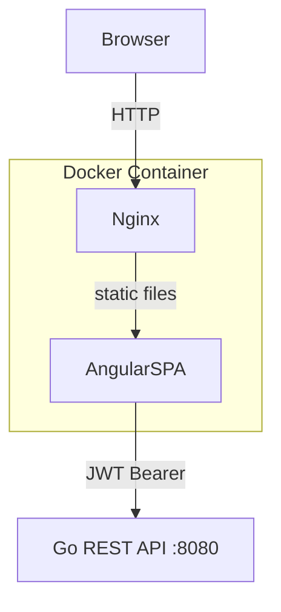

# Design Document: POS Frontend

## Overview

The POS Frontend is an Angular 17+ single-page application (SPA) that provides a point-of-sale interface and an administration section for inventory management. It connects to a Go REST API at a configurable base URL (default `http://localhost:8080`) using JWT Bearer token authentication. The application is packaged as a Docker container using a multi-stage build: Node 20 Alpine compiles the Angular app, and Nginx Alpine serves the static output with SPA routing support.

The application has two primary areas:
- **POS Interface** — cashier-facing product search and transaction processing
- **Admin Section** — management of products, categories, locations, suppliers, inventory movements, and reports

---

## Architecture



### Key Architectural Decisions

- **Standalone Components** (Angular 17+): No NgModules; each component declares its own imports.
- **Lazy-loaded feature routes**: Each feature area (auth, pos, admin sub-sections) is a separate lazy chunk to minimize initial bundle size.
- **HTTP Interceptor**: A single `AuthInterceptor` attaches the JWT Bearer token to all `/api/v1/*` requests and handles 401 responses by redirecting to login.
- **Reactive Forms**: All forms use `ReactiveFormsModule` for validation and state management.
- **Environment-driven API URL**: `environment.ts` / `environment.prod.ts` hold `apiBaseUrl`; the Docker build injects the value via `--build-arg`.
- **TailwindCSS**: Utility-first styling for rapid, consistent UI without a heavy component library dependency.

---

## Components and Interfaces

### Routing Structure

```
/login                          → LoginComponent (public)
/                               → redirect → /pos (auth guard)
/pos                            → PosShellComponent (auth guard)
/admin                          → AdminShellComponent (auth guard)
  /admin/products               → ProductListComponent
  /admin/products/new           → ProductFormComponent
  /admin/products/:id/edit      → ProductFormComponent
  /admin/categories             → CategoryListComponent
  /admin/categories/new         → CategoryFormComponent
  /admin/categories/:id/edit    → CategoryFormComponent
  /admin/locations              → LocationListComponent
  /admin/locations/new          → LocationFormComponent
  /admin/locations/:id/edit     → LocationFormComponent
  /admin/suppliers              → SupplierListComponent
  /admin/suppliers/new          → SupplierFormComponent
  /admin/suppliers/:id/edit     → SupplierFormComponent
  /admin/inventory              → InventoryListComponent
  /admin/inventory/receive      → ReceiveFormComponent
  /admin/inventory/ship         → ShipFormComponent
  /admin/inventory/transfer     → TransferFormComponent
  /admin/inventory/adjust       → AdjustFormComponent
  /admin/reports                → ReportsDashboardComponent
  /admin/reports/stock          → StockReportComponent
  /admin/reports/alerts         → AlertsReportComponent
  /admin/reports/valuation      → ValuationReportComponent
  /admin/reports/turnover       → TurnoverReportComponent
  /admin/reports/suppliers      → SupplierPerformanceComponent
  /admin/reports/movements      → RecentMovementsComponent
  /admin/reports/aging          → AgingReportComponent
```

### Component Tree

```
AppComponent
├── RouterOutlet
│   ├── LoginComponent
│   ├── PosShellComponent
│   │   ├── TopNavComponent
│   │   ├── ProductSearchComponent
│   │   └── TransactionPanelComponent
│   │       └── TransactionItemComponent (×n)
│   └── AdminShellComponent
│       ├── TopNavComponent
│       ├── SidebarNavComponent
│       └── RouterOutlet (admin child routes)
│           ├── ProductListComponent / ProductFormComponent
│           ├── CategoryListComponent / CategoryFormComponent
│           ├── LocationListComponent / LocationFormComponent
│           ├── SupplierListComponent / SupplierFormComponent
│           ├── InventoryListComponent
│           │   └── Receive/Ship/Transfer/AdjustFormComponent
│           └── Reports* Components
```

### Services

| Service | Responsibility |
|---|---|
| `AuthService` | Login, logout, token storage (sessionStorage), session restore, auth state signal |
| `AuthInterceptor` | Attach `Authorization: Bearer <token>` to `/api/v1/*` requests; handle 401 |
| `ApiHealthService` | Poll `GET /health` on startup; expose connectivity status |
| `ProductService` | CRUD for products, SKU lookup |
| `CategoryService` | CRUD for categories |
| `LocationService` | CRUD for locations |
| `SupplierService` | CRUD for suppliers |
| `InventoryService` | Receive, ship, transfer, adjust movements; movement history |
| `ReportService` | All report endpoints |
| `TransactionService` | In-memory cart state (items, running total, submit) |

### Guards

- `AuthGuard` (`canActivate`): Checks `AuthService.isAuthenticated()`; redirects to `/login` if false.

---

## Data Models

```typescript
// Auth
interface LoginRequest { username: string; password: string; }
interface LoginResponse { token: string; }

// Product
interface Product {
  id: number;
  sku: string;
  name: string;
  description?: string;
  price: number;
  category_id?: number;
  category?: Category;
  stock?: StockInfo[];
  created_at: string;
  updated_at: string;
}

interface ProductCreateRequest {
  sku: string;
  name: string;
  description?: string;
  price: number;
  category_id?: number;
}

// Category
interface Category { id: number; name: string; description?: string; }
interface CategoryCreateRequest { name: string; description?: string; }

// Location
interface Location { id: number; name: string; description?: string; }
interface LocationCreateRequest { name: string; description?: string; }

// Supplier
interface Supplier { id: number; name: string; contact_info?: string; }
interface SupplierCreateRequest { name: string; contact_info?: string; }

// Inventory
interface StockInfo { location_id: number; location_name: string; quantity: number; }

interface InventoryMovement {
  id: number;
  type: 'receive' | 'ship' | 'transfer' | 'adjust';
  product_id: number;
  product_name: string;
  quantity: number;
  location_id?: number;
  source_location_id?: number;
  destination_location_id?: number;
  supplier_id?: number;
  reason?: string;
  created_at: string;
}

interface ReceiveRequest { product_id: number; location_id: number; quantity: number; supplier_id: number; }
interface ShipRequest { product_id: number; location_id: number; quantity: number; }
interface TransferRequest { product_id: number; source_location_id: number; destination_location_id: number; quantity: number; }
interface AdjustRequest { product_id: number; location_id: number; quantity_delta: number; reason: string; }

// Transaction (client-side only)
interface TransactionItem { product: Product; quantity: number; }
interface Transaction { items: TransactionItem[]; total: number; }

// Reports
interface StockSummary { total_products: number; total_value: number; low_stock_count: number; }
interface StockLevel { product_id: number; product_name: string; sku: string; location_name: string; quantity: number; }
interface StockAlert { product_id: number; product_name: string; sku: string; quantity: number; threshold: number; }
interface ValuationReport { total_value: number; items: ValuationItem[]; }
interface ValuationItem { product_id: number; product_name: string; quantity: number; unit_price: number; total_value: number; }
interface TurnoverReport { items: TurnoverItem[]; }
interface TurnoverItem { product_id: number; product_name: string; movement_count: number; }
interface SupplierPerformance { supplier_id: number; supplier_name: string; total_received: number; last_delivery: string; }
interface AgingItem { product_id: number; product_name: string; days_in_inventory: number; quantity: number; }

// Pagination
interface PaginatedResponse<T> { data: T[]; total: number; page: number; page_size: number; }

// API Error
interface ApiError { error: string; message?: string; }
```

### Docker & Nginx Configuration

**Dockerfile** (multi-stage):

```dockerfile
# Stage 1: Build
FROM node:20-alpine AS build
WORKDIR /app
ARG API_BASE_URL=http://localhost:8080
COPY package*.json ./
RUN npm ci
COPY . .
RUN sed -i "s|__API_BASE_URL__|${API_BASE_URL}|g" src/environments/environment.prod.ts
RUN npm run build -- --configuration production

# Stage 2: Serve
FROM nginx:alpine
COPY --from=build /app/dist/pos-frontend/browser /usr/share/nginx/html
COPY nginx.conf /etc/nginx/conf.d/default.conf
EXPOSE 80
```

**nginx.conf**:

```nginx
server {
  listen 80;
  root /usr/share/nginx/html;
  index index.html;

  location / {
    try_files $uri $uri/ /index.html;
  }

  location /api/ {
    proxy_pass http://api:8080;
  }
}
```

**environment.prod.ts** (placeholder replaced at build time):

```typescript
export const environment = {
  production: true,
  apiBaseUrl: '__API_BASE_URL__'
};
```


---

## Correctness Properties

*A property is a characteristic or behavior that should hold true across all valid executions of a system — essentially, a formal statement about what the system should do. Properties serve as the bridge between human-readable specifications and machine-verifiable correctness guarantees.*

### Property 1: Auth guard redirects unauthenticated users

*For any* protected route URL, when `AuthService.isAuthenticated()` returns false, the Angular router should navigate to `/login` and not render the protected component.

**Validates: Requirements 1.1, 9.3**

---

### Property 2: JWT attached to all /api/v1/* requests

*For any* outgoing HTTP request whose URL contains `/api/v1/`, the `AuthInterceptor` should add an `Authorization: Bearer <token>` header equal to the token stored in sessionStorage.

**Validates: Requirements 1.7**

---

### Property 3: 401 response clears token and redirects to login

*For any* HTTP response with status 401 received by the `AuthInterceptor`, the token should be removed from sessionStorage and the router should navigate to `/login`.

**Validates: Requirements 1.5**

---

### Property 4: Invalid credentials show safe error message

*For any* login attempt that receives a non-2xx response from the API, the displayed error message should be non-empty and should not contain stack traces, SQL, or internal server details.

**Validates: Requirements 1.3**

---

### Property 5: Product search is debounced

*For any* sequence of keystrokes entered into the product search input within a 500ms window, the `ProductService` should be called at most once — after the 500ms debounce period elapses from the last keystroke.

**Validates: Requirements 2.2**

---

### Property 6: Transaction item management

*For any* product added to the transaction, the transaction should contain that product with quantity 1. Subsequently, for any quantity increment the quantity should increase by 1, for any decrement it should decrease by 1 (removing the item when quantity reaches 0), and for any explicit remove the item should no longer appear in the transaction.

**Validates: Requirements 2.3, 2.4**

---

### Property 7: Running total invariant

*For any* transaction state containing a set of items, the displayed running total should equal the sum of (price × quantity) for every item in the transaction.

**Validates: Requirements 2.5**

---

### Property 8: Transaction submission calls ship per line item

*For any* transaction with N line items, completing the transaction should result in exactly N POST requests to `/api/v1/inventory/ship`, each carrying the correct `product_id`, `location_id`, and `quantity`.

**Validates: Requirements 2.6**

---

### Property 9: API error preserves transaction state

*For any* transaction state, if any ship API call returns an error response during submission, the transaction items should remain unchanged (no items removed, quantities unchanged).

**Validates: Requirements 2.8**

---

### Property 10: Required field validation prevents form submission

*For any* entity form (product, category, location, supplier) or movement form (receive, ship, transfer, adjust), if any required field is empty or contains only whitespace, the form should be invalid and the submit action should not dispatch an HTTP request.

**Validates: Requirements 3.7, 4.4, 5.4, 6.4, 7.6**

---

### Property 11: CRUD forms dispatch correct HTTP method and URL

*For any* entity (product, category, location, supplier), submitting a create form should dispatch a POST to the entity's collection endpoint, and submitting an edit form for a given ID should dispatch a PUT to the entity's item endpoint with that ID.

**Validates: Requirements 3.2, 3.3, 4.2, 4.3, 5.2, 5.3, 6.2, 6.3**

---

### Property 12: Delete requires confirmation before dispatching DELETE

*For any* product, clicking delete without confirming should not dispatch a DELETE request; confirming should dispatch exactly one DELETE to `/api/v1/products/{id}`.

**Validates: Requirements 3.4**

---

### Property 13: Movement forms dispatch correct endpoint with required fields

*For any* inventory movement form submission (receive, ship, transfer, adjust), the dispatched POST request should target the correct endpoint and include all required fields for that movement type.

**Validates: Requirements 7.2, 7.3, 7.4, 7.5**

---

### Property 14: Report navigation calls correct API endpoint

*For any* report view (stock, alerts, valuation, turnover, supplier performance, recent movements, aging), navigating to that view should trigger exactly one GET request to the corresponding report endpoint.

**Validates: Requirements 8.1, 8.2, 8.3, 8.4, 8.5, 8.6, 8.7, 8.8**

---

### Property 15: Nav bar visible only when authenticated

*For any* application state, the persistent navigation bar should be rendered if and only if `AuthService.isAuthenticated()` returns true.

**Validates: Requirements 9.2**

---

## Error Handling

| Scenario | Handling |
|---|---|
| Login failure (4xx) | Show API error message; do not expose stack trace |
| 401 on any API call | `AuthInterceptor` clears token, redirects to `/login` |
| 404 on SKU lookup | Display "Product not found" inline |
| API error on movement submit | Display error message returned by API; preserve form state |
| API error on transaction submit | Display error; preserve transaction items |
| API health check failure | Show persistent connectivity warning banner |
| Form validation failure | Inline field-level error messages; disable submit button |
| Network timeout | Surface generic "Unable to reach server" message |

All HTTP errors are handled in service methods returning `Observable` with `catchError`. Components subscribe and update local error state. No raw error objects are ever displayed to the user.

---

## Testing Strategy

### Dual Testing Approach

Both unit tests and property-based tests are required and complementary:

- **Unit tests** cover specific examples, integration points, and edge cases
- **Property tests** verify universal behaviors across randomized inputs

### Unit Tests

Focus areas:
- `AuthService`: login flow, logout, session restore, token storage
- `AuthInterceptor`: header injection, 401 handling
- `TransactionService`: add/remove/update items, total calculation
- `ProductFormComponent`: validation states, submit behavior
- `AuthGuard`: redirect behavior for unauthenticated routes
- `ApiHealthService`: connectivity warning trigger
- Report components: correct endpoint called on init

### Property-Based Testing

**Library**: [fast-check](https://github.com/dubzzz/fast-check) (TypeScript-native, works with Jest/Jasmine)

**Configuration**: Minimum 100 runs per property (`{ numRuns: 100 }`)

**Tag format**: Each property test must include a comment:
```
// Feature: pos-frontend, Property <N>: <property_text>
```

**Property test mapping**:

| Property | Test Description | fast-check Arbitraries |
|---|---|---|
| P1: Auth guard redirects | Generate random route URLs; verify redirect | `fc.webUrl()` filtered to protected paths |
| P2: JWT header injection | Generate random `/api/v1/*` paths; verify header | `fc.string()` prefixed with `/api/v1/` |
| P3: 401 clears token | Generate any API response with status 401 | `fc.record({ status: fc.constant(401) })` |
| P4: Safe error messages | Generate API error responses; verify display string | `fc.string()` for error body |
| P5: Search debounce | Generate keystroke sequences with timing | `fc.array(fc.string())` with fake timers |
| P6: Transaction item management | Generate random products and operations | `fc.record({ id, price, name })` |
| P7: Running total | Generate random item arrays with prices/quantities | `fc.array(fc.record({ price: fc.float(), qty: fc.integer() }))` |
| P8: Ship calls per item | Generate transactions with N items | `fc.array(transactionItemArb, { minLength: 1 })` |
| P9: Error preserves state | Generate transaction + error response | `fc.tuple(transactionArb, errorArb)` |
| P10: Validation blocks submit | Generate forms with one or more empty required fields | `fc.record` with `fc.constant('')` for required fields |
| P11: CRUD HTTP method/URL | Generate entity data and IDs | `fc.record` for each entity type |
| P12: Delete confirmation | Generate product IDs; test with/without confirm | `fc.integer({ min: 1 })` |
| P13: Movement form endpoints | Generate movement data for each type | `fc.oneof(receiveArb, shipArb, transferArb, adjustArb)` |
| P14: Report endpoint routing | Generate report type selection | `fc.constantFrom('stock', 'alerts', 'valuation', ...)` |
| P15: Nav bar auth state | Generate authenticated/unauthenticated states | `fc.boolean()` for auth state |

Each correctness property must be implemented by a **single** property-based test. Property tests run alongside unit tests via `ng test` (Karma/Jest).
