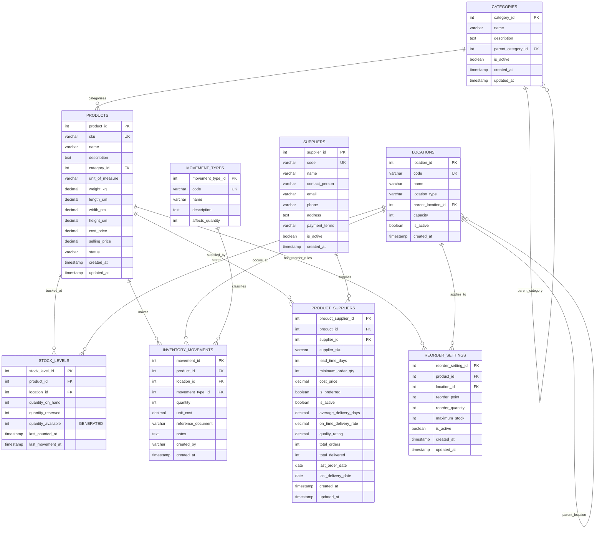
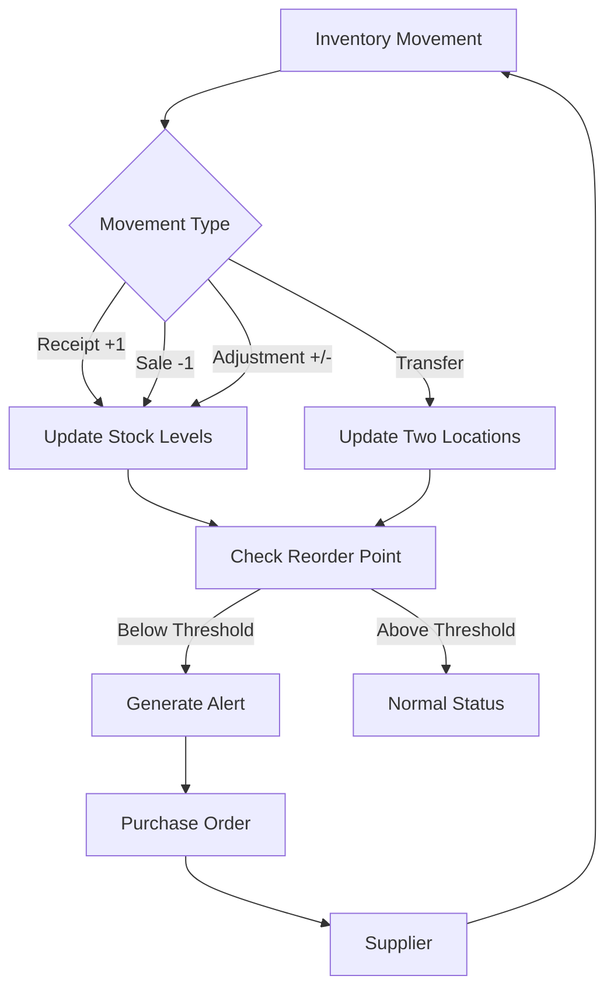

# Comprehensive Inventory Management System Documentation

## Table of Contents

1. [System Overview](#system-overview)
2. [Entity Relationship Diagram](#entity-relationship-diagram)
3. [Database Tables Reference](#database-tables-reference)
4. [Stored Procedures API](#stored-procedures-api)
5. [Reporting Views and Functions](#reporting-views-and-functions)
6. [Usage Examples](#usage-examples)
7. [Best Practices Guide](#best-practices-guide)
8. [Performance Optimization](#performance-optimization)
9. [Maintenance and Troubleshooting](#maintenance-and-troubleshooting)

---

## System Overview

The Inventory Management System is a comprehensive PostgreSQL database schema designed to track products, stock levels, locations, suppliers, and inventory movements. It provides complete audit trails, automated stock updates, and extensive reporting capabilities.

### Key Features

- **Multi-location inventory tracking** with hierarchical organization
- **Automated stock level updates** via database triggers
- **Complete audit trail** of all inventory transactions
- **Supplier performance tracking** with metrics
- **Automated reorder point management**
- **Comprehensive reporting** with multiple valuation methods
- **Transaction safety** with atomic operations
- **Performance optimized** with strategic indexing

### Requirements Satisfied

This system satisfies all requirements outlined in the specification:

- **Requirement 1**: Detailed product information storage
- **Requirement 2**: Multi-location stock level tracking
- **Requirement 3**: Supplier management and reorder automation
- **Requirement 4**: Complete inventory movement tracking
- **Requirement 5**: Comprehensive reporting and analytics

---

## Entity Relationship Diagram

### Core Entity Relationships



### Data Flow Diagram



---

## Database Tables Reference

### 1. categories

**Purpose**: Product classification with hierarchical structure support.

**Columns**:

| Column | Type | Constraints | Description |
|--------|------|-------------|-------------|
| category_id | SERIAL | PRIMARY KEY | Unique identifier for the category |
| name | VARCHAR(100) | NOT NULL | Category name (must not be empty) |
| description | TEXT | | Detailed description of the category |
| parent_category_id | INTEGER | FK → categories | Parent category for hierarchical structure |
| is_active | BOOLEAN | DEFAULT true | Whether the category is active |
| created_at | TIMESTAMP | DEFAULT CURRENT_TIMESTAMP | Record creation timestamp |
| updated_at | TIMESTAMP | DEFAULT CURRENT_TIMESTAMP | Last update timestamp (auto-updated) |

**Relationships**:
- Self-referencing: `parent_category_id` → `categories.category_id` (hierarchical structure)
- One-to-many: `category_id` → `products.category_id`

**Indexes**:
- `idx_categories_parent` on `parent_category_id`
- `idx_categories_active` on `is_active` (filtered)
- `idx_categories_name` on `name`

**Constraints**:
- `categories_name_not_empty`: Name must have content after trimming

**Example**:
```sql
-- Top-level category
INSERT INTO categories (name, description) 
VALUES ('Electronics', 'Electronic devices and components');

-- Sub-category
INSERT INTO categories (name, description, parent_category_id) 
VALUES ('Laptops', 'Portable computers', 1);
```

---

### 2. products

**Purpose**: Master product catalog with detailed attributes and pricing.

**Columns**:

| Column | Type | Constraints | Description |
|--------|------|-------------|-------------|
| product_id | SERIAL | PRIMARY KEY | Unique identifier for the product |
| sku | VARCHAR(50) | UNIQUE, NOT NULL | Stock Keeping Unit - unique product code |
| name | VARCHAR(200) | NOT NULL | Product name |
| description | TEXT | | Detailed product description |
| category_id | INTEGER | FK → categories | Product category |
| unit_of_measure | VARCHAR(20) | NOT NULL | Unit of measure (each, box, kg, etc.) |
| weight_kg | DECIMAL(10,3) | ≥ 0 | Product weight in kilograms |
| length_cm | DECIMAL(8,2) | ≥ 0 | Product length in centimeters |
| width_cm | DECIMAL(8,2) | ≥ 0 | Product width in centimeters |
| height_cm | DECIMAL(8,2) | ≥ 0 | Product height in centimeters |
| cost_price | DECIMAL(12,2) | ≥ 0 | Cost price per unit |
| selling_price | DECIMAL(12,2) | ≥ 0 | Selling price per unit |
| status | VARCHAR(20) | DEFAULT 'active' | Product status: active, discontinued, pending |
| created_at | TIMESTAMP | DEFAULT CURRENT_TIMESTAMP | Record creation timestamp |
| updated_at | TIMESTAMP | DEFAULT CURRENT_TIMESTAMP | Last update timestamp (auto-updated) |

**Relationships**:
- Many-to-one: `category_id` → `categories.category_id`
- One-to-many: `product_id` → `stock_levels.product_id`
- One-to-many: `product_id` → `inventory_movements.product_id`
- One-to-many: `product_id` → `product_suppliers.product_id`
- One-to-many: `product_id` → `reorder_settings.product_id`

**Indexes**:
- `idx_products_sku` on `sku`
- `idx_products_category` on `category_id`
- `idx_products_status` on `status`
- `idx_products_name` on `name`
- `idx_products_active` on `status` (filtered for 'active')

**Constraints**:
- `products_sku_not_empty`: SKU must have content
- `products_name_not_empty`: Name must have content
- `products_uom_not_empty`: Unit of measure must have content
- `products_status_valid`: Status must be 'active', 'discontinued', or 'pending'
- `products_weight_positive`: Weight must be non-negative
- `products_dimensions_positive`: All dimensions must be non-negative
- `products_prices_positive`: All prices must be non-negative

**Example**:
```sql
INSERT INTO products (
    sku, name, description, category_id, unit_of_measure,
    weight_kg, length_cm, width_cm, height_cm,
    cost_price, selling_price, status
) VALUES (
    'LAPTOP001', 'Business Laptop 15"', 'High-performance business laptop',
    5, 'each', 2.5, 35.0, 25.0, 2.0, 800.00, 1200.00, 'active'
);
```

---

### 3. locations

**Purpose**: Storage locations with hierarchical organization (warehouse → zone → aisle → bin).

**Columns**:

| Column | Type | Constraints | Description |
|--------|------|-------------|-------------|
| location_id | SERIAL | PRIMARY KEY | Unique identifier for the location |
| code | VARCHAR(50) | UNIQUE, NOT NULL | Location code (e.g., WH001, A01-B02) |
| name | VARCHAR(100) | NOT NULL | Location name |
| location_type | VARCHAR(30) | NOT NULL | Type: warehouse, zone, aisle, bin, etc. |
| parent_location_id | INTEGER | FK → locations | Parent location for hierarchy |
| capacity | INTEGER | > 0 | Maximum capacity (optional) |
| is_active | BOOLEAN | DEFAULT true | Whether the location is active |
| created_at | TIMESTAMP | DEFAULT CURRENT_TIMESTAMP | Record creation timestamp |

**Relationships**:
- Self-referencing: `parent_location_id` → `locations.location_id` (hierarchical structure)
- One-to-many: `location_id` → `stock_levels.location_id`
- One-to-many: `location_id` → `inventory_movements.location_id`
- One-to-many: `location_id` → `reorder_settings.location_id`

**Indexes**:
- `idx_locations_code` on `code`
- `idx_locations_parent` on `parent_location_id`
- `idx_locations_type` on `location_type`
- `idx_locations_active` on `is_active` (filtered)

**Constraints**:
- `locations_code_not_empty`: Code must have content
- `locations_name_not_empty`: Name must have content
- `locations_type_not_empty`: Type must have content
- `locations_capacity_positive`: Capacity must be positive if specified

**Example**:
```sql
-- Warehouse
INSERT INTO locations (code, name, location_type) 
VALUES ('WH001', 'Main Warehouse', 'warehouse');

-- Zone within warehouse
INSERT INTO locations (code, name, location_type, parent_location_id) 
VALUES ('WH001-Z01', 'Zone A', 'zone', 1);

-- Bin within zone
INSERT INTO locations (code, name, location_type, parent_location_id, capacity) 
VALUES ('WH001-Z01-B01', 'Bin A01', 'bin', 2, 100);
```

---

### 4. suppliers

**Purpose**: Vendor information and contact details for procurement.

**Columns**:

| Column | Type | Constraints | Description |
|--------|------|-------------|-------------|
| supplier_id | SERIAL | PRIMARY KEY | Unique identifier for the supplier |
| code | VARCHAR(50) | UNIQUE, NOT NULL | Supplier code |
| name | VARCHAR(200) | NOT NULL | Supplier name |
| contact_person | VARCHAR(100) | | Primary contact person |
| email | VARCHAR(100) | Valid email format | Contact email address |
| phone | VARCHAR(30) | | Contact phone number |
| address | TEXT | | Supplier address |
| payment_terms | VARCHAR(50) | | Payment terms (e.g., Net 30) |
| is_active | BOOLEAN | DEFAULT true | Whether the supplier is active |
| created_at | TIMESTAMP | DEFAULT CURRENT_TIMESTAMP | Record creation timestamp |

**Relationships**:
- One-to-many: `supplier_id` → `product_suppliers.supplier_id`

**Indexes**:
- `idx_suppliers_code` on `code`
- `idx_suppliers_name` on `name`
- `idx_suppliers_active` on `is_active` (filtered)

**Constraints**:
- `suppliers_code_not_empty`: Code must have content
- `suppliers_name_not_empty`: Name must have content
- `suppliers_email_format`: Email must be valid format if provided

**Example**:
```sql
INSERT INTO suppliers (
    code, name, contact_person, email, phone, payment_terms
) VALUES (
    'TECH001', 'TechCorp Solutions', 'Jane Doe', 
    'jane@techcorp.com', '+1-555-0100', 'Net 30'
);
```

---

### 5. stock_levels

**Purpose**: Current inventory quantities by product and location with automatic available quantity calculation.

**Columns**:

| Column | Type | Constraints | Description |
|--------|------|-------------|-------------|
| stock_level_id | SERIAL | PRIMARY KEY | Unique identifier |
| product_id | INTEGER | NOT NULL, FK → products | Product being tracked |
| location_id | INTEGER | NOT NULL, FK → locations | Storage location |
| quantity_on_hand | INTEGER | NOT NULL, ≥ 0, DEFAULT 0 | Total quantity in stock |
| quantity_reserved | INTEGER | NOT NULL, ≥ 0, DEFAULT 0 | Quantity allocated but not shipped |
| quantity_available | INTEGER | GENERATED ALWAYS | Calculated: on_hand - reserved |
| last_counted_at | TIMESTAMP | | Last physical count timestamp |
| last_movement_at | TIMESTAMP | DEFAULT CURRENT_TIMESTAMP | Last movement timestamp |

**Relationships**:
- Many-to-one: `product_id` → `products.product_id`
- Many-to-one: `location_id` → `locations.location_id`

**Indexes**:
- `idx_stock_levels_product` on `product_id`
- `idx_stock_levels_location` on `location_id`
- `idx_stock_levels_available` on `quantity_available` (filtered for > 0)

**Constraints**:
- `stock_levels_unique_product_location`: Unique combination of product and location
- `stock_levels_positive_quantities`: All quantities must be non-negative, reserved ≤ on_hand

**Notes**:
- `quantity_available` is automatically calculated and cannot be manually set
- Updated automatically by the `update_stock_levels()` trigger when inventory movements occur

**Example**:
```sql
-- Stock levels are typically updated via inventory movements, not direct INSERT
-- But can be initialized:
INSERT INTO stock_levels (product_id, location_id, quantity_on_hand) 
VALUES (1, 1, 100);
```

---

### 6. inventory_movements

**Purpose**: Complete audit trail of all inventory transactions.

**Columns**:

| Column | Type | Constraints | Description |
|--------|------|-------------|-------------|
| movement_id | SERIAL | PRIMARY KEY | Unique identifier for the movement |
| product_id | INTEGER | NOT NULL, FK → products | Product being moved |
| location_id | INTEGER | NOT NULL, FK → locations | Location of the movement |
| movement_type_id | INTEGER | NOT NULL, FK → movement_types | Type of movement |
| quantity | INTEGER | NOT NULL, ≠ 0 | Quantity moved (always positive) |
| unit_cost | DECIMAL(12,2) | ≥ 0 | Cost per unit |
| reference_document | VARCHAR(100) | | Reference to source document (PO, SO, etc.) |
| notes | TEXT | | Additional notes about the movement |
| created_by | VARCHAR(100) | NOT NULL | Username who created the movement |
| created_at | TIMESTAMP | DEFAULT CURRENT_TIMESTAMP | Movement timestamp |

**Relationships**:
- Many-to-one: `product_id` → `products.product_id`
- Many-to-one: `location_id` → `locations.location_id`
- Many-to-one: `movement_type_id` → `movement_types.movement_type_id`

**Indexes**:
- `idx_inventory_movements_product_date` on `(product_id, created_at)`
- `idx_inventory_movements_location_date` on `(location_id, created_at)`
- `idx_inventory_movements_type` on `movement_type_id`

**Constraints**:
- `inventory_movements_quantity_not_zero`: Quantity cannot be zero
- `inventory_movements_created_by_not_empty`: Created by must have content
- `inventory_movements_unit_cost_positive`: Unit cost must be non-negative

**Triggers**:
- `trigger_update_stock_levels`: Automatically updates stock_levels after INSERT

**Example**:
```sql
-- Use stored procedures instead of direct INSERT for safety
-- But direct INSERT is possible:
INSERT INTO inventory_movements (
    product_id, location_id, movement_type_id, quantity,
    unit_cost, reference_document, notes, created_by
) VALUES (
    1, 1, 1, 50, 800.00, 'PO-2024-001', 'Initial receipt', 'john_doe'
);
```

---

### 7. movement_types

**Purpose**: Lookup table for different types of inventory movements.

**Columns**:

| Column | Type | Constraints | Description |
|--------|------|-------------|-------------|
| movement_type_id | SERIAL | PRIMARY KEY | Unique identifier |
| code | VARCHAR(20) | UNIQUE, NOT NULL | Movement type code |
| name | VARCHAR(50) | NOT NULL | Movement type name |
| description | TEXT | | Detailed description |
| affects_quantity | INTEGER | NOT NULL, IN (-1, 1) | Direction: 1 for increase, -1 for decrease |

**Relationships**:
- One-to-many: `movement_type_id` → `inventory_movements.movement_type_id`

**Constraints**:
- `movement_types_code_not_empty`: Code must have content
- `movement_types_name_not_empty`: Name must have content
- `movement_types_affects_quantity_valid`: Must be -1 or 1

**Standard Movement Types**:
- RECEIPT (affects_quantity = 1): Receiving inventory from suppliers
- SALE (affects_quantity = -1): Shipping inventory to customers
- TRANSFER_IN (affects_quantity = 1): Receiving from another location
- TRANSFER_OUT (affects_quantity = -1): Sending to another location
- ADJUSTMENT (affects_quantity = 1 or -1): Inventory adjustments

**Example**:
```sql
INSERT INTO movement_types (code, name, description, affects_quantity) VALUES
('RECEIPT', 'Receipt', 'Inventory received from supplier', 1),
('SALE', 'Sale', 'Inventory sold to customer', -1),
('ADJUSTMENT', 'Adjustment', 'Inventory adjustment (count, damage, etc.)', 1);
```

---

### 8. reorder_settings

**Purpose**: Automated reordering configuration by product and location.

**Columns**:

| Column | Type | Constraints | Description |
|--------|------|-------------|-------------|
| reorder_setting_id | SERIAL | PRIMARY KEY | Unique identifier |
| product_id | INTEGER | NOT NULL, FK → products | Product for reorder rule |
| location_id | INTEGER | NOT NULL, FK → locations | Location for reorder rule |
| reorder_point | INTEGER | NOT NULL, ≥ 0 | Stock level that triggers reorder |
| reorder_quantity | INTEGER | NOT NULL, > 0 | Quantity to order when triggered |
| maximum_stock | INTEGER | ≥ reorder_point | Maximum stock level to maintain |
| is_active | BOOLEAN | DEFAULT true | Whether the rule is active |
| created_at | TIMESTAMP | DEFAULT CURRENT_TIMESTAMP | Record creation timestamp |
| updated_at | TIMESTAMP | DEFAULT CURRENT_TIMESTAMP | Last update timestamp (auto-updated) |

**Relationships**:
- Many-to-one: `product_id` → `products.product_id`
- Many-to-one: `location_id` → `locations.location_id`

**Indexes**:
- `idx_reorder_settings_product` on `product_id`
- `idx_reorder_settings_location` on `location_id`
- `idx_reorder_settings_active` on `is_active` (filtered)

**Constraints**:
- `reorder_settings_unique_product_location`: Unique combination of product and location
- `reorder_settings_positive_values`: All values must be positive, maximum ≥ reorder_point

**Example**:
```sql
INSERT INTO reorder_settings (
    product_id, location_id, reorder_point, reorder_quantity, maximum_stock
) VALUES (
    1, 1, 20, 50, 100
);
```

---

### 9. product_suppliers

**Purpose**: Product-supplier relationships with terms and performance tracking.

**Columns**:

| Column | Type | Constraints | Description |
|--------|------|-------------|-------------|
| product_supplier_id | SERIAL | PRIMARY KEY | Unique identifier |
| product_id | INTEGER | NOT NULL, FK → products | Product |
| supplier_id | INTEGER | NOT NULL, FK → suppliers | Supplier |
| supplier_sku | VARCHAR(100) | | Supplier's internal SKU/part number |
| lead_time_days | INTEGER | ≥ 0 | Expected delivery time in days |
| minimum_order_qty | INTEGER | > 0 | Minimum order quantity |
| cost_price | DECIMAL(12,2) | ≥ 0 | Cost price from this supplier |
| is_preferred | BOOLEAN | DEFAULT false | Whether this is the preferred supplier |
| is_active | BOOLEAN | DEFAULT true | Whether this relationship is active |
| average_delivery_days | DECIMAL(5,2) | ≥ 0 | Actual average delivery time |
| on_time_delivery_rate | DECIMAL(5,4) | 0.0-1.0 | Percentage delivered on time |
| quality_rating | DECIMAL(3,2) | 0.0-5.0 | Quality rating (0-5 scale) |
| total_orders | INTEGER | ≥ 0, DEFAULT 0 | Total orders placed |
| total_delivered | INTEGER | ≥ 0, ≤ total_orders | Total orders delivered |
| last_order_date | DATE | | Date of last order |
| last_delivery_date | DATE | | Date of last delivery |
| created_at | TIMESTAMP | DEFAULT CURRENT_TIMESTAMP | Record creation timestamp |
| updated_at | TIMESTAMP | DEFAULT CURRENT_TIMESTAMP | Last update timestamp (auto-updated) |

**Relationships**:
- Many-to-one: `product_id` → `products.product_id`
- Many-to-one: `supplier_id` → `suppliers.supplier_id`

**Indexes**:
- `idx_product_suppliers_product` on `product_id`
- `idx_product_suppliers_supplier` on `supplier_id`
- `idx_product_suppliers_preferred` on `(product_id, is_preferred)` (filtered)
- `idx_product_suppliers_active` on `is_active` (filtered)
- `idx_product_suppliers_supplier_sku` on `(supplier_id, supplier_sku)`
- `idx_product_suppliers_performance` on `(quality_rating DESC, on_time_delivery_rate DESC)` (filtered)

**Constraints**:
- `product_suppliers_unique_product_supplier`: Unique combination of product and supplier
- `product_suppliers_lead_time_positive`: Lead time must be non-negative
- `product_suppliers_min_order_positive`: Minimum order quantity must be positive
- `product_suppliers_cost_positive`: Cost must be non-negative
- `product_suppliers_delivery_days_positive`: Average delivery days must be non-negative
- `product_suppliers_delivery_rate_valid`: Delivery rate must be between 0 and 1
- `product_suppliers_quality_rating_valid`: Quality rating must be between 0 and 5
- `product_suppliers_order_counts_valid`: Delivered ≤ total orders

**Example**:
```sql
INSERT INTO product_suppliers (
    product_id, supplier_id, supplier_sku, lead_time_days,
    minimum_order_qty, cost_price, is_preferred
) VALUES (
    1, 1, 'TECH-LAP-001', 14, 10, 750.00, true
);
```

---

## Stored Procedures API

The system provides four main stored procedures for safe inventory operations. All procedures implement atomic transactions with comprehensive error handling.

### 1. receive_inventory()

Records inventory receipt from suppliers with validation.

**Signature**:
```sql
receive_inventory(
    p_product_id INTEGER,
    p_location_id INTEGER,
    p_quantity INTEGER,
    p_unit_cost DECIMAL(12,2),
    p_reference_document VARCHAR(100),
    p_notes TEXT,
    p_created_by VARCHAR(100)
) RETURNS TABLE (
    success BOOLEAN,
    message TEXT,
    movement_id INTEGER,
    new_stock_level INTEGER
)
```

**Parameters**:
- `p_product_id`: Product being received (must exist and be active)
- `p_location_id`: Receiving location (must exist and be active)
- `p_quantity`: Quantity received (must be positive)
- `p_unit_cost`: Cost per unit (must be non-negative)
- `p_reference_document`: Reference (e.g., PO number)
- `p_notes`: Additional notes
- `p_created_by`: Username (required)

**Returns**:
- `success`: true if successful, false if error
- `message`: Descriptive message
- `movement_id`: ID of created movement record
- `new_stock_level`: Updated stock quantity

**Example**:
```sql
SELECT * FROM receive_inventory(
    1,              -- product_id
    1,              -- location_id
    50,             -- quantity
    800.00,         -- unit_cost
    'PO-2024-001',  -- reference_document
    'Initial stock receipt',
    'john_doe'      -- created_by
);
```

---

### 2. ship_inventory()

Records inventory shipment to customers with stock validation.

**Signature**:
```sql
ship_inventory(
    p_product_id INTEGER,
    p_location_id INTEGER,
    p_quantity INTEGER,
    p_unit_cost DECIMAL(12,2),
    p_reference_document VARCHAR(100),
    p_notes TEXT,
    p_created_by VARCHAR(100)
) RETURNS TABLE (
    success BOOLEAN,
    message TEXT,
    movement_id INTEGER,
    new_stock_level INTEGER
)
```

**Parameters**: Same as receive_inventory()

**Validations**:
- All standard validations plus:
- Sufficient stock available (quantity_on_hand ≥ p_quantity)

**Example**:
```sql
SELECT * FROM ship_inventory(
    1,              -- product_id
    1,              -- location_id
    10,             -- quantity
    800.00,         -- unit_cost
    'SO-2024-200',  -- reference_document
    'Customer order #12345',
    'jane_smith'    -- created_by
);
```

**Error Handling**:
```sql
-- Returns success=false if insufficient stock
-- Example output:
-- success | message                                    | movement_id | new_stock_level
-- false   | Insufficient stock. Available: 5, Needed: 10 | NULL        | NULL
```

---

### 3. transfer_inventory()

Transfers inventory between locations atomically.

**Signature**:
```sql
transfer_inventory(
    p_product_id INTEGER,
    p_from_location_id INTEGER,
    p_to_location_id INTEGER,
    p_quantity INTEGER,
    p_unit_cost DECIMAL(12,2),
    p_reference_document VARCHAR(100),
    p_notes TEXT,
    p_created_by VARCHAR(100)
) RETURNS TABLE (
    success BOOLEAN,
    message TEXT,
    movement_id_out INTEGER,
    movement_id_in INTEGER,
    from_location_stock INTEGER,
    to_location_stock INTEGER
)
```

**Parameters**:
- `p_product_id`: Product being transferred
- `p_from_location_id`: Source location
- `p_to_location_id`: Destination location
- `p_quantity`: Quantity to transfer
- `p_unit_cost`: Cost per unit
- `p_reference_document`: Reference (e.g., transfer order number)
- `p_notes`: Additional notes
- `p_created_by`: Username

**Returns**:
- `success`: true if successful
- `message`: Descriptive message
- `movement_id_out`: ID of outbound movement
- `movement_id_in`: ID of inbound movement
- `from_location_stock`: Updated stock at source
- `to_location_stock`: Updated stock at destination

**Validations**:
- From and to locations must be different
- Sufficient stock at source location
- Both locations must exist and be active

**Example**:
```sql
SELECT * FROM transfer_inventory(
    1,              -- product_id
    1,              -- from_location_id
    2,              -- to_location_id
    25,             -- quantity
    800.00,         -- unit_cost
    'TRF-2024-300', -- reference_document
    'Rebalancing stock',
    'warehouse_mgr' -- created_by
);
```

**Transaction Safety**:
- Both movements (out and in) are created in a single transaction
- If either fails, both are rolled back
- Stock levels are updated atomically

---

### 4. adjust_inventory()

Adjusts inventory levels for counts, damage, or corrections.

**Signature**:
```sql
adjust_inventory(
    p_product_id INTEGER,
    p_location_id INTEGER,
    p_adjustment_quantity INTEGER,
    p_reason TEXT,
    p_reference_document VARCHAR(100),
    p_created_by VARCHAR(100)
) RETURNS TABLE (
    success BOOLEAN,
    message TEXT,
    movement_id INTEGER,
    new_stock_level INTEGER,
    adjustment_type VARCHAR(20)
)
```

**Parameters**:
- `p_product_id`: Product being adjusted
- `p_location_id`: Location of adjustment
- `p_adjustment_quantity`: Adjustment amount (positive or negative)
- `p_reason`: Reason for adjustment (required)
- `p_reference_document`: Reference document
- `p_created_by`: Username

**Returns**:
- `success`: true if successful
- `message`: Descriptive message
- `movement_id`: ID of created movement
- `new_stock_level`: Updated stock quantity
- `adjustment_type`: 'INCREASE' or 'DECREASE'

**Validations**:
- Adjustment quantity cannot be zero
- Reason is required
- For negative adjustments, sufficient stock must be available

**Examples**:
```sql
-- Positive adjustment (found extra items during count)
SELECT * FROM adjust_inventory(
    1,              -- product_id
    1,              -- location_id
    5,              -- adjustment_quantity (positive)
    'Physical count found 5 additional units',
    'ADJ-2024-400',
    'inventory_clerk'
);

-- Negative adjustment (damaged items)
SELECT * FROM adjust_inventory(
    1,              -- product_id
    1,              -- location_id
    -3,             -- adjustment_quantity (negative)
    'Damaged units found during inspection',
    'ADJ-2024-401',
    'qa_inspector'
);
```

---

## Reporting Views and Functions

For complete reporting documentation, see [REPORTING_DOCUMENTATION.md](REPORTING_DOCUMENTATION.md).

### Quick Reference

**Current Stock Views**:
- `v_current_stock_levels` - Detailed stock levels with product and location info
- `v_product_stock_summary` - Aggregated stock by product across all locations
- `v_location_stock_summary` - Stock summary by location

**Valuation Functions**:
- `calculate_inventory_valuation_fifo(product_id, location_id)` - FIFO costing
- `calculate_inventory_valuation_avg(product_id, location_id)` - Weighted average
- `calculate_inventory_valuation_standard(product_id, location_id)` - Standard cost

**Aging Views**:
- `v_inventory_aging` - Detailed aging with buckets (0-30, 31-60, 61-90, etc.)
- `v_inventory_aging_summary` - Summary by aging bucket

**Alert Views**:
- `v_low_stock_alerts` - Products below reorder point with alert levels
- `v_approaching_reorder` - Products approaching reorder point (within 20%)

**Turnover Analysis**:
- `calculate_inventory_turnover(start_date, end_date, product_id, location_id)` - Turnover calculation
- `v_inventory_turnover_90days` - Last 90 days turnover
- `v_slow_moving_inventory` - Turnover < 1.0
- `v_fast_moving_inventory` - Turnover ≥ 4.0

**Dashboard View**:
- `v_inventory_health_dashboard` - Comprehensive health overview

**Utility Functions**:
- `get_product_movement_history(product_id, location_id, start_date, end_date, limit)` - Movement history

---

## Usage Examples

### Common Workflows

#### 1. Setting Up a New Product

```sql
-- Step 1: Create category (if needed)
INSERT INTO categories (name, description) 
VALUES ('Office Supplies', 'General office supplies and equipment');

-- Step 2: Add the product
INSERT INTO products (
    sku, name, description, category_id, unit_of_measure,
    cost_price, selling_price, status
) VALUES (
    'DESK001', 'Executive Desk', 'Large executive desk with drawers',
    10, 'each', 450.00, 750.00, 'active'
);

-- Step 3: Add supplier relationship
INSERT INTO product_suppliers (
    product_id, supplier_id, supplier_sku, lead_time_days,
    minimum_order_qty, cost_price, is_preferred
) VALUES (
    (SELECT product_id FROM products WHERE sku = 'DESK001'),
    1, 'FURN-DESK-EX', 21, 5, 450.00, true
);

-- Step 4: Set reorder rules
INSERT INTO reorder_settings (
    product_id, location_id, reorder_point, reorder_quantity, maximum_stock
) VALUES (
    (SELECT product_id FROM products WHERE sku = 'DESK001'),
    1, 5, 10, 20
);
```

#### 2. Receiving Inventory from Supplier

```sql
-- Receive 50 units of product
SELECT * FROM receive_inventory(
    (SELECT product_id FROM products WHERE sku = 'DESK001'),
    (SELECT location_id FROM locations WHERE code = 'WH001'),
    50,
    450.00,
    'PO-2024-1001',
    'Received from FurnitureCo - Invoice #12345',
    'receiving_clerk'
);

-- Verify stock level
SELECT 
    p.sku, p.name, l.code AS location,
    s.quantity_on_hand, s.quantity_available
FROM stock_levels s
JOIN products p ON s.product_id = p.product_id
JOIN locations l ON s.location_id = l.location_id
WHERE p.sku = 'DESK001';
```

#### 3. Processing Customer Orders

```sql
-- Check available stock before shipping
SELECT 
    p.sku, p.name, l.code AS location,
    s.quantity_available
FROM stock_levels s
JOIN products p ON s.product_id = p.product_id
JOIN locations l ON s.location_id = l.location_id
WHERE p.sku = 'DESK001' AND s.quantity_available >= 3;

-- Ship 3 units to customer
SELECT * FROM ship_inventory(
    (SELECT product_id FROM products WHERE sku = 'DESK001'),
    (SELECT location_id FROM locations WHERE code = 'WH001'),
    3,
    450.00,
    'SO-2024-5001',
    'Customer order - ABC Company',
    'shipping_clerk'
);
```

#### 4. Transferring Between Locations

```sql
-- Transfer 10 units from main warehouse to retail store
SELECT * FROM transfer_inventory(
    (SELECT product_id FROM products WHERE sku = 'DESK001'),
    (SELECT location_id FROM locations WHERE code = 'WH001'),
    (SELECT location_id FROM locations WHERE code = 'STORE01'),
    10,
    450.00,
    'TRF-2024-0050',
    'Stock replenishment for retail location',
    'warehouse_manager'
);

-- View stock at both locations
SELECT 
    p.sku, p.name, l.code AS location,
    s.quantity_on_hand, s.quantity_available
FROM stock_levels s
JOIN products p ON s.product_id = p.product_id
JOIN locations l ON s.location_id = l.location_id
WHERE p.sku = 'DESK001'
ORDER BY l.code;
```

#### 5. Performing Cycle Counts

```sql
-- Physical count shows 47 units, but system shows 50
-- Calculate adjustment needed
SELECT 
    p.sku,
    s.quantity_on_hand AS system_count,
    47 AS physical_count,
    47 - s.quantity_on_hand AS adjustment_needed
FROM stock_levels s
JOIN products p ON s.product_id = p.product_id
WHERE p.sku = 'DESK001' AND s.location_id = 1;

-- Record the adjustment
SELECT * FROM adjust_inventory(
    (SELECT product_id FROM products WHERE sku = 'DESK001'),
    1,
    -3,  -- Negative adjustment
    'Cycle count discrepancy - 3 units missing',
    'CC-2024-0123',
    'inventory_auditor'
);

-- Update last counted timestamp
UPDATE stock_levels
SET last_counted_at = CURRENT_TIMESTAMP
WHERE product_id = (SELECT product_id FROM products WHERE sku = 'DESK001')
  AND location_id = 1;
```

#### 6. Monitoring Low Stock and Reordering

```sql
-- Check for low stock alerts
SELECT 
    product_name, location_code, quantity_available,
    reorder_point, reorder_quantity, alert_level,
    preferred_supplier_name, lead_time_days
FROM v_low_stock_alerts
WHERE alert_level IN ('OUT_OF_STOCK', 'CRITICAL', 'LOW')
ORDER BY 
    CASE alert_level
        WHEN 'OUT_OF_STOCK' THEN 1
        WHEN 'CRITICAL' THEN 2
        WHEN 'LOW' THEN 3
    END,
    quantity_available;

-- Generate purchase order list
SELECT 
    product_name,
    sku,
    preferred_supplier_name,
    reorder_quantity AS order_qty,
    lead_time_days,
    'PO-' || TO_CHAR(CURRENT_DATE, 'YYYYMMDD') || '-' || 
        LPAD(product_id::TEXT, 4, '0') AS suggested_po_number
FROM v_low_stock_alerts
WHERE alert_level IN ('OUT_OF_STOCK', 'CRITICAL')
ORDER BY alert_level;
```

#### 7. Analyzing Inventory Value

```sql
-- Compare valuation methods
SELECT 
    'FIFO' AS method,
    SUM(fifo_value) AS total_value,
    COUNT(*) AS products_valued
FROM calculate_inventory_valuation_fifo()
UNION ALL
SELECT 
    'Weighted Average',
    SUM(avg_value),
    COUNT(*)
FROM calculate_inventory_valuation_avg()
UNION ALL
SELECT 
    'Standard Cost',
    SUM(standard_value),
    COUNT(*)
FROM calculate_inventory_valuation_standard();

-- Get detailed valuation by category
SELECT 
    c.name AS category,
    COUNT(DISTINCT f.product_id) AS product_count,
    SUM(f.quantity_on_hand) AS total_units,
    SUM(f.fifo_value) AS total_fifo_value,
    AVG(f.average_unit_cost) AS avg_unit_cost
FROM calculate_inventory_valuation_fifo() f
JOIN products p ON f.product_id = p.product_id
JOIN categories c ON p.category_id = c.category_id
GROUP BY c.name
ORDER BY total_fifo_value DESC;
```

#### 8. Reviewing Inventory Aging

```sql
-- Get aging summary
SELECT 
    aging_bucket,
    item_count,
    total_quantity,
    total_value,
    ROUND(100.0 * total_value / SUM(total_value) OVER (), 2) AS percent_of_total
FROM v_inventory_aging_summary
ORDER BY 
    CASE aging_bucket
        WHEN '0-30 days' THEN 1
        WHEN '31-60 days' THEN 2
        WHEN '61-90 days' THEN 3
        WHEN '91-180 days' THEN 4
        WHEN '181-365 days' THEN 5
        WHEN 'Over 1 year' THEN 6
    END;

-- Identify old inventory for clearance
SELECT 
    product_name, sku, location_code,
    days_in_stock, quantity_available,
    inventory_value, cost_price
FROM v_inventory_aging
WHERE days_in_stock > 180
  AND quantity_available > 0
ORDER BY inventory_value DESC
LIMIT 20;
```

#### 9. Analyzing Inventory Turnover

```sql
-- Get turnover for last 90 days
SELECT 
    product_name, location_code,
    total_sales_quantity,
    ROUND(average_inventory, 0) AS avg_inventory,
    ROUND(turnover_ratio, 2) AS turnover,
    ROUND(days_of_supply, 0) AS days_supply
FROM v_inventory_turnover_90days
WHERE total_sales_quantity > 0
ORDER BY turnover_ratio DESC
LIMIT 20;

-- Compare fast vs slow movers
SELECT 
    'Fast Moving' AS category,
    COUNT(*) AS product_count,
    AVG(turnover_ratio) AS avg_turnover,
    AVG(days_of_supply) AS avg_days_supply
FROM v_fast_moving_inventory
UNION ALL
SELECT 
    'Slow Moving',
    COUNT(*),
    AVG(turnover_ratio),
    AVG(days_of_supply)
FROM v_slow_moving_inventory;
```

#### 10. Generating Inventory Health Dashboard

```sql
-- Overall inventory health summary
SELECT 
    stock_status,
    COUNT(*) AS item_count,
    SUM(quantity_on_hand) AS total_units,
    SUM(inventory_value) AS total_value,
    ROUND(100.0 * COUNT(*) / SUM(COUNT(*)) OVER (), 2) AS percent_of_items
FROM v_inventory_health_dashboard
GROUP BY stock_status
ORDER BY 
    CASE stock_status
        WHEN 'OUT_OF_STOCK' THEN 1
        WHEN 'LOW_STOCK' THEN 2
        WHEN 'NORMAL' THEN 3
        WHEN 'OVERSTOCK' THEN 4
    END;

-- Problem inventory requiring attention
SELECT 
    product_name, sku, location_code,
    quantity_available, stock_status,
    aging_bucket, inventory_value
FROM v_inventory_health_dashboard
WHERE stock_status IN ('OUT_OF_STOCK', 'OVERSTOCK')
   OR aging_bucket IN ('181-365 days', 'Over 1 year')
ORDER BY 
    CASE stock_status
        WHEN 'OUT_OF_STOCK' THEN 1
        WHEN 'OVERSTOCK' THEN 2
        ELSE 3
    END,
    inventory_value DESC;
```

---

## Best Practices Guide

### Data Management

#### 1. Product Management

**DO**:
- Use meaningful, consistent SKU naming conventions (e.g., CAT-TYPE-###)
- Always set appropriate product status (active, discontinued, pending)
- Keep product descriptions detailed and up-to-date
- Set realistic cost and selling prices
- Assign products to appropriate categories

**DON'T**:
- Reuse SKUs for different products
- Leave critical fields (unit_of_measure, cost_price) empty
- Create products without assigning to a category
- Use special characters in SKUs that might cause issues in other systems

**Example SKU Convention**:
```
ELEC-LAP-001  (Electronics - Laptop - 001)
FURN-DESK-EX  (Furniture - Desk - Executive)
SUPP-PEN-BLK  (Supplies - Pen - Black)
```

#### 2. Location Management

**DO**:
- Use hierarchical structure (Warehouse → Zone → Aisle → Bin)
- Use consistent location code format
- Set capacity limits where applicable
- Mark inactive locations rather than deleting them
- Document location types clearly

**DON'T**:
- Create flat location structures without hierarchy
- Use ambiguous location codes
- Delete locations with historical inventory movements

**Example Location Hierarchy**:
```
WH001 (Warehouse)
├── WH001-Z01 (Zone A)
│   ├── WH001-Z01-A01 (Aisle 1)
│   │   ├── WH001-Z01-A01-B01 (Bin 1)
│   │   └── WH001-Z01-A01-B02 (Bin 2)
│   └── WH001-Z01-A02 (Aisle 2)
└── WH001-Z02 (Zone B)
```

#### 3. Inventory Movements

**DO**:
- Always use stored procedures for inventory operations
- Provide meaningful reference documents (PO numbers, SO numbers)
- Include detailed notes explaining the movement
- Use consistent username format for created_by
- Record unit_cost for accurate valuation

**DON'T**:
- Directly INSERT into inventory_movements without validation
- Skip reference documents or notes
- Use generic usernames like 'admin' or 'system'
- Leave unit_cost NULL for receipts

**Reference Document Conventions**:
```
PO-YYYY-####  (Purchase Orders)
SO-YYYY-####  (Sales Orders)
TRF-YYYY-#### (Transfers)
ADJ-YYYY-#### (Adjustments)
CC-YYYY-####  (Cycle Counts)
```

#### 4. Reorder Management

**DO**:
- Set reorder points based on lead time and demand
- Calculate reorder quantity considering MOQ and EOQ
- Set maximum stock to prevent overstock
- Review and adjust reorder settings quarterly
- Keep reorder settings active for active products

**DON'T**:
- Set reorder points too low (risk stockouts)
- Set reorder points too high (tie up capital)
- Forget to update settings when demand patterns change
- Set reorder quantity below supplier MOQ

**Reorder Point Formula**:
```
Reorder Point = (Average Daily Demand × Lead Time Days) + Safety Stock

Example:
- Average daily demand: 5 units
- Lead time: 14 days
- Safety stock: 20 units (1 week buffer)
- Reorder point = (5 × 14) + 20 = 90 units
```

#### 5. Supplier Management

**DO**:
- Track multiple suppliers per product for redundancy
- Mark one supplier as preferred
- Update performance metrics regularly
- Maintain accurate lead times
- Document payment terms clearly

**DON'T**:
- Rely on single supplier for critical products
- Ignore supplier performance data
- Keep inactive suppliers marked as active
- Forget to update lead times when they change

**Supplier Performance Tracking**:
```sql
-- Update supplier performance after delivery
UPDATE product_suppliers
SET 
    total_delivered = total_delivered + 1,
    last_delivery_date = CURRENT_DATE,
    average_delivery_days = (
        (average_delivery_days * total_delivered + actual_delivery_days) / 
        (total_delivered + 1)
    ),
    on_time_delivery_rate = (
        (on_time_delivery_rate * total_delivered + 
         CASE WHEN on_time THEN 1.0 ELSE 0.0 END) / 
        (total_delivered + 1)
    )
WHERE product_supplier_id = ?;
```

### Transaction Safety

#### 1. Use Stored Procedures

**Always use stored procedures** for inventory operations instead of direct SQL:

```sql
-- GOOD: Using stored procedure
SELECT * FROM receive_inventory(1, 1, 50, 800.00, 'PO-001', 'Receipt', 'user');

-- BAD: Direct manipulation
BEGIN;
INSERT INTO inventory_movements (...) VALUES (...);
UPDATE stock_levels SET quantity_on_hand = quantity_on_hand + 50 WHERE ...;
COMMIT;
```

**Why?**
- Procedures include validation logic
- Automatic error handling and rollback
- Consistent business rule enforcement
- Audit trail compliance

#### 2. Handle Errors Gracefully

```sql
-- Check procedure result before proceeding
DO $
DECLARE
    result RECORD;
BEGIN
    SELECT * INTO result FROM ship_inventory(1, 1, 100, 800.00, 'SO-001', 'Ship', 'user');
    
    IF NOT result.success THEN
        RAISE NOTICE 'Shipment failed: %', result.message;
        -- Handle error (notify user, log, etc.)
    ELSE
        RAISE NOTICE 'Shipment successful. New stock: %', result.new_stock_level;
        -- Proceed with next steps
    END IF;
END $;
```

#### 3. Verify Stock Before Operations

```sql
-- Check stock availability before attempting shipment
SELECT 
    p.sku, p.name,
    s.quantity_available,
    CASE 
        WHEN s.quantity_available >= 100 THEN 'Sufficient'
        ELSE 'Insufficient - Available: ' || s.quantity_available
    END AS stock_status
FROM stock_levels s
JOIN products p ON s.product_id = p.product_id
WHERE p.product_id = 1 AND s.location_id = 1;
```

### Performance Optimization

#### 1. Use Indexes Effectively

The schema includes strategic indexes. Use them in WHERE clauses:

```sql
-- GOOD: Uses idx_products_sku
SELECT * FROM products WHERE sku = 'LAPTOP001';

-- GOOD: Uses idx_stock_levels_product
SELECT * FROM stock_levels WHERE product_id = 1;

-- LESS OPTIMAL: Full table scan
SELECT * FROM products WHERE LOWER(name) LIKE '%laptop%';
```

#### 2. Limit Result Sets

```sql
-- GOOD: Limited results
SELECT * FROM inventory_movements 
WHERE product_id = 1 
ORDER BY created_at DESC 
LIMIT 100;

-- BAD: Potentially millions of rows
SELECT * FROM inventory_movements;
```

#### 3. Use Views for Complex Queries

```sql
-- GOOD: Use pre-built view
SELECT * FROM v_current_stock_levels WHERE sku = 'LAPTOP001';

-- LESS OPTIMAL: Reconstruct the join every time
SELECT p.*, l.*, s.* 
FROM stock_levels s
JOIN products p ON s.product_id = p.product_id
JOIN locations l ON s.location_id = l.location_id
WHERE p.sku = 'LAPTOP001';
```

#### 4. Filter Early in Queries

```sql
-- GOOD: Filter before aggregation
SELECT category_id, COUNT(*) 
FROM products 
WHERE status = 'active'
GROUP BY category_id;

-- LESS OPTIMAL: Filter after aggregation
SELECT category_id, COUNT(*) 
FROM products 
GROUP BY category_id, status
HAVING status = 'active';
```

### Data Integrity

#### 1. Maintain Referential Integrity

**DO**:
- Let foreign keys enforce relationships
- Use CASCADE carefully (prefer RESTRICT for safety)
- Validate data before INSERT/UPDATE

**DON'T**:
- Disable foreign key constraints
- Delete parent records with active children
- Bypass validation logic

#### 2. Use Constraints

The schema includes comprehensive constraints. Don't try to bypass them:

```sql
-- GOOD: Respects constraints
INSERT INTO products (sku, name, unit_of_measure, status)
VALUES ('DESK001', 'Executive Desk', 'each', 'active');

-- BAD: Will fail constraint
INSERT INTO products (sku, name, unit_of_measure, status)
VALUES ('', 'Desk', '', 'invalid_status');  -- Violates multiple constraints
```

#### 3. Audit Trail Preservation

**DO**:
- Keep all inventory_movements records permanently
- Archive old movements to separate table if needed
- Never delete movement records

**DON'T**:
- Delete inventory_movements to "clean up"
- Modify historical movement records
- Bypass the created_by field

### Reporting Best Practices

#### 1. Use Appropriate Valuation Method

**FIFO** (First In, First Out):
- Best for: Perishable goods, fashion items
- Reflects: Current market value
- Use when: Inventory turnover is important

**Weighted Average**:
- Best for: Commodities, bulk items
- Reflects: Average cost over time
- Use when: Prices fluctuate frequently

**Standard Cost**:
- Best for: Manufacturing, budgeting
- Reflects: Planned/budgeted costs
- Use when: Cost control is priority

#### 2. Regular Reporting Schedule

**Daily**:
- Low stock alerts (`v_low_stock_alerts`)
- Out of stock items
- Today's movements

**Weekly**:
- Inventory aging (`v_inventory_aging`)
- Slow-moving inventory
- Reorder recommendations

**Monthly**:
- Inventory valuation (all methods)
- Turnover analysis
- Supplier performance
- Inventory health dashboard

**Quarterly**:
- Review reorder settings
- Analyze inventory trends
- Optimize stock levels
- Supplier relationship review

#### 3. Dashboard Queries

Create materialized views for frequently-accessed dashboards:

```sql
-- Create materialized view for daily dashboard
CREATE MATERIALIZED VIEW mv_daily_inventory_dashboard AS
SELECT 
    (SELECT COUNT(*) FROM v_low_stock_alerts WHERE alert_level = 'OUT_OF_STOCK') AS out_of_stock_count,
    (SELECT COUNT(*) FROM v_low_stock_alerts WHERE alert_level = 'CRITICAL') AS critical_count,
    (SELECT SUM(total_inventory_value_cost) FROM v_location_stock_summary) AS total_inventory_value,
    (SELECT COUNT(*) FROM v_slow_moving_inventory) AS slow_moving_count,
    (SELECT COUNT(*) FROM v_inventory_aging WHERE days_in_stock > 180) AS aged_inventory_count;

-- Refresh nightly
REFRESH MATERIALIZED VIEW mv_daily_inventory_dashboard;
```

### Security and Access Control

#### 1. User Roles

Implement role-based access:

```sql
-- Create roles
CREATE ROLE inventory_viewer;
CREATE ROLE inventory_clerk;
CREATE ROLE inventory_manager;

-- Viewer: Read-only access
GRANT SELECT ON ALL TABLES IN SCHEMA public TO inventory_viewer;
GRANT SELECT ON ALL SEQUENCES IN SCHEMA public TO inventory_viewer;

-- Clerk: Can perform inventory operations
GRANT inventory_viewer TO inventory_clerk;
GRANT EXECUTE ON FUNCTION receive_inventory TO inventory_clerk;
GRANT EXECUTE ON FUNCTION ship_inventory TO inventory_clerk;
GRANT EXECUTE ON FUNCTION adjust_inventory TO inventory_clerk;

-- Manager: Full access
GRANT inventory_clerk TO inventory_manager;
GRANT EXECUTE ON FUNCTION transfer_inventory TO inventory_manager;
GRANT INSERT, UPDATE ON products, categories, suppliers TO inventory_manager;
```

#### 2. Audit Logging

Track who does what:

```sql
-- Create audit log table
CREATE TABLE audit_log (
    audit_id SERIAL PRIMARY KEY,
    table_name VARCHAR(50),
    operation VARCHAR(10),
    user_name VARCHAR(100),
    old_values JSONB,
    new_values JSONB,
    created_at TIMESTAMP DEFAULT CURRENT_TIMESTAMP
);

-- Create audit trigger function
CREATE OR REPLACE FUNCTION audit_trigger_function()
RETURNS TRIGGER AS $
BEGIN
    IF TG_OP = 'INSERT' THEN
        INSERT INTO audit_log (table_name, operation, user_name, new_values)
        VALUES (TG_TABLE_NAME, TG_OP, current_user, row_to_json(NEW));
    ELSIF TG_OP = 'UPDATE' THEN
        INSERT INTO audit_log (table_name, operation, user_name, old_values, new_values)
        VALUES (TG_TABLE_NAME, TG_OP, current_user, row_to_json(OLD), row_to_json(NEW));
    ELSIF TG_OP = 'DELETE' THEN
        INSERT INTO audit_log (table_name, operation, user_name, old_values)
        VALUES (TG_TABLE_NAME, TG_OP, current_user, row_to_json(OLD));
    END IF;
    RETURN NULL;
END;
$ LANGUAGE plpgsql;

-- Apply to sensitive tables
CREATE TRIGGER audit_products
    AFTER INSERT OR UPDATE OR DELETE ON products
    FOR EACH ROW EXECUTE FUNCTION audit_trigger_function();
```

---

## Maintenance and Troubleshooting

### Regular Maintenance Tasks

#### Daily Tasks

1. **Monitor Low Stock Alerts**
```sql
-- Check critical alerts
SELECT COUNT(*) AS critical_alerts
FROM v_low_stock_alerts
WHERE alert_level IN ('OUT_OF_STOCK', 'CRITICAL');

-- Review and action alerts
SELECT product_name, location_code, quantity_available, alert_level
FROM v_low_stock_alerts
WHERE alert_level IN ('OUT_OF_STOCK', 'CRITICAL')
ORDER BY alert_level;
```

2. **Verify Today's Movements**
```sql
-- Check today's inventory activity
SELECT 
    mt.name AS movement_type,
    COUNT(*) AS movement_count,
    SUM(im.quantity) AS total_quantity
FROM inventory_movements im
JOIN movement_types mt ON im.movement_type_id = mt.movement_type_id
WHERE DATE(im.created_at) = CURRENT_DATE
GROUP BY mt.name;
```

3. **Check for Data Anomalies**
```sql
-- Find negative stock (should not exist)
SELECT p.sku, p.name, l.code, s.quantity_on_hand
FROM stock_levels s
JOIN products p ON s.product_id = p.product_id
JOIN locations l ON s.location_id = l.location_id
WHERE s.quantity_on_hand < 0;

-- Find reserved > on_hand (should not exist)
SELECT p.sku, p.name, l.code, s.quantity_on_hand, s.quantity_reserved
FROM stock_levels s
JOIN products p ON s.product_id = p.product_id
JOIN locations l ON s.location_id = l.location_id
WHERE s.quantity_reserved > s.quantity_on_hand;
```

#### Weekly Tasks

1. **Review Inventory Aging**
```sql
-- Check aging inventory
SELECT aging_bucket, item_count, total_value
FROM v_inventory_aging_summary
ORDER BY 
    CASE aging_bucket
        WHEN '0-30 days' THEN 1
        WHEN '31-60 days' THEN 2
        WHEN '61-90 days' THEN 3
        WHEN '91-180 days' THEN 4
        WHEN '181-365 days' THEN 5
        WHEN 'Over 1 year' THEN 6
    END;
```

2. **Analyze Slow-Moving Inventory**
```sql
-- Review slow movers for action
SELECT product_name, location_code, average_inventory, days_of_supply
FROM v_slow_moving_inventory
WHERE average_inventory > 10
ORDER BY days_of_supply DESC
LIMIT 20;
```

3. **Database Statistics Update**
```sql
-- Update table statistics for query optimizer
ANALYZE categories;
ANALYZE products;
ANALYZE locations;
ANALYZE suppliers;
ANALYZE stock_levels;
ANALYZE inventory_movements;
ANALYZE product_suppliers;
ANALYZE reorder_settings;
```

#### Monthly Tasks

1. **Inventory Valuation Report**
```sql
-- Generate monthly valuation comparison
SELECT 
    'FIFO' AS method,
    SUM(fifo_value) AS total_value
FROM calculate_inventory_valuation_fifo()
UNION ALL
SELECT 
    'Weighted Average',
    SUM(avg_value)
FROM calculate_inventory_valuation_avg()
UNION ALL
SELECT 
    'Standard Cost',
    SUM(standard_value)
FROM calculate_inventory_valuation_standard();
```

2. **Supplier Performance Review**
```sql
-- Review supplier performance
SELECT 
    s.name AS supplier_name,
    COUNT(ps.product_supplier_id) AS products_supplied,
    AVG(ps.average_delivery_days) AS avg_delivery_days,
    AVG(ps.on_time_delivery_rate) AS on_time_rate,
    AVG(ps.quality_rating) AS avg_quality
FROM suppliers s
JOIN product_suppliers ps ON s.supplier_id = ps.supplier_id
WHERE ps.is_active = true
GROUP BY s.name
ORDER BY on_time_rate DESC, avg_quality DESC;
```

3. **Vacuum and Reindex**
```sql
-- Reclaim space and rebuild indexes
VACUUM ANALYZE inventory_movements;
REINDEX TABLE inventory_movements;

VACUUM ANALYZE stock_levels;
REINDEX TABLE stock_levels;
```

#### Quarterly Tasks

1. **Review and Adjust Reorder Settings**
```sql
-- Identify reorder settings that may need adjustment
SELECT 
    p.sku, p.name, l.code,
    rs.reorder_point, rs.reorder_quantity,
    t.turnover_ratio, t.days_of_supply
FROM reorder_settings rs
JOIN products p ON rs.product_id = p.product_id
JOIN locations l ON rs.location_id = l.location_id
LEFT JOIN v_inventory_turnover_90days t 
    ON rs.product_id = t.product_id AND rs.location_id = t.location_id
WHERE rs.is_active = true
ORDER BY t.turnover_ratio DESC NULLS LAST;
```

2. **Archive Old Movements**
```sql
-- Archive movements older than 2 years
CREATE TABLE IF NOT EXISTS inventory_movements_archive (
    LIKE inventory_movements INCLUDING ALL
);

-- Move old records to archive
INSERT INTO inventory_movements_archive
SELECT * FROM inventory_movements
WHERE created_at < CURRENT_DATE - INTERVAL '2 years';

-- Verify archive
SELECT COUNT(*) FROM inventory_movements_archive;

-- Delete archived records (after verification)
-- DELETE FROM inventory_movements
-- WHERE created_at < CURRENT_DATE - INTERVAL '2 years';
```

3. **Database Backup Verification**
```bash
# Verify backup exists and is recent
ls -lh /backup/path/inventory_management_*.dump

# Test restore to staging environment
pg_restore -d inventory_staging /backup/path/inventory_management_latest.dump
```

### Common Issues and Solutions

#### Issue 1: Insufficient Stock Error

**Symptom**: `ship_inventory()` returns "Insufficient stock" error

**Diagnosis**:
```sql
-- Check actual stock levels
SELECT 
    p.sku, p.name, l.code,
    s.quantity_on_hand, s.quantity_reserved, s.quantity_available
FROM stock_levels s
JOIN products p ON s.product_id = p.product_id
JOIN locations l ON s.location_id = l.location_id
WHERE p.product_id = ? AND l.location_id = ?;
```

**Solutions**:
1. Check if stock is reserved for other orders
2. Transfer stock from another location
3. Receive new inventory from supplier
4. Adjust inventory if physical count differs

#### Issue 2: Stock Level Mismatch

**Symptom**: Stock levels don't match physical count

**Diagnosis**:
```sql
-- Review recent movements
SELECT * FROM get_product_movement_history(?, ?, NULL, NULL, 50);

-- Check for missing movements
SELECT 
    DATE(created_at) AS movement_date,
    COUNT(*) AS movement_count
FROM inventory_movements
WHERE product_id = ?
GROUP BY DATE(created_at)
ORDER BY movement_date DESC;
```

**Solutions**:
1. Perform physical count
2. Use `adjust_inventory()` to correct discrepancy
3. Document reason for adjustment
4. Update `last_counted_at` timestamp

```sql
-- Correct stock level
SELECT * FROM adjust_inventory(
    ?,  -- product_id
    ?,  -- location_id
    ?,  -- adjustment_quantity (positive or negative)
    'Physical count correction - actual count differs from system',
    'CC-' || TO_CHAR(CURRENT_DATE, 'YYYYMMDD'),
    current_user
);

-- Update last counted timestamp
UPDATE stock_levels
SET last_counted_at = CURRENT_TIMESTAMP
WHERE product_id = ? AND location_id = ?;
```

#### Issue 3: Slow Query Performance

**Symptom**: Queries taking too long to execute

**Diagnosis**:
```sql
-- Check query execution plan
EXPLAIN ANALYZE
SELECT * FROM v_current_stock_levels WHERE sku = 'LAPTOP001';

-- Check for missing indexes
SELECT 
    schemaname, tablename, indexname, indexdef
FROM pg_indexes
WHERE schemaname = 'public'
ORDER BY tablename, indexname;

-- Check table statistics
SELECT 
    schemaname, tablename, 
    n_live_tup AS row_count,
    n_dead_tup AS dead_rows,
    last_vacuum, last_analyze
FROM pg_stat_user_tables
WHERE schemaname = 'public'
ORDER BY n_live_tup DESC;
```

**Solutions**:
1. Run VACUUM ANALYZE on affected tables
2. Rebuild indexes if fragmented
3. Add missing indexes for frequently-queried columns
4. Consider partitioning large tables

```sql
-- Update statistics
ANALYZE inventory_movements;

-- Rebuild fragmented index
REINDEX INDEX idx_inventory_movements_product_date;

-- Add missing index (example)
CREATE INDEX idx_products_category_status 
ON products(category_id, status) 
WHERE status = 'active';
```

#### Issue 4: Trigger Not Firing

**Symptom**: Stock levels not updating after inventory movement

**Diagnosis**:
```sql
-- Check if trigger exists
SELECT 
    trigger_name, event_manipulation, event_object_table,
    action_statement, action_timing
FROM information_schema.triggers
WHERE trigger_schema = 'public'
  AND trigger_name = 'trigger_update_stock_levels';

-- Check if trigger function exists
SELECT proname, prosrc
FROM pg_proc
WHERE proname = 'update_stock_levels';

-- Test trigger manually
INSERT INTO inventory_movements (
    product_id, location_id, movement_type_id, quantity,
    unit_cost, reference_document, created_by
) VALUES (
    1, 1, 1, 1, 100.00, 'TEST', 'test_user'
);

-- Check if stock level updated
SELECT * FROM stock_levels WHERE product_id = 1 AND location_id = 1;
```

**Solutions**:
1. Recreate trigger if missing
2. Check trigger function for errors
3. Verify movement_types table has correct affects_quantity values

```sql
-- Recreate trigger
DROP TRIGGER IF EXISTS trigger_update_stock_levels ON inventory_movements;

CREATE TRIGGER trigger_update_stock_levels
    AFTER INSERT ON inventory_movements
    FOR EACH ROW
    EXECUTE FUNCTION update_stock_levels();
```

#### Issue 5: Duplicate SKU Error

**Symptom**: Cannot insert product due to duplicate SKU

**Diagnosis**:
```sql
-- Check for existing SKU
SELECT product_id, sku, name, status
FROM products
WHERE sku = 'LAPTOP001';
```

**Solutions**:
1. Use different SKU if product is truly different
2. Update existing product if it's the same item
3. Reactivate discontinued product if appropriate

```sql
-- Reactivate discontinued product
UPDATE products
SET status = 'active', updated_at = CURRENT_TIMESTAMP
WHERE sku = 'LAPTOP001' AND status = 'discontinued';
```

#### Issue 6: Foreign Key Constraint Violation

**Symptom**: Cannot delete record due to foreign key constraint

**Diagnosis**:
```sql
-- Check for dependent records
-- Example: Trying to delete a product
SELECT 
    'stock_levels' AS table_name, COUNT(*) AS dependent_records
FROM stock_levels WHERE product_id = ?
UNION ALL
SELECT 'inventory_movements', COUNT(*)
FROM inventory_movements WHERE product_id = ?
UNION ALL
SELECT 'product_suppliers', COUNT(*)
FROM product_suppliers WHERE product_id = ?
UNION ALL
SELECT 'reorder_settings', COUNT(*)
FROM reorder_settings WHERE product_id = ?;
```

**Solutions**:
1. Mark record as inactive instead of deleting
2. Delete or reassign dependent records first
3. Use CASCADE delete (use with extreme caution)

```sql
-- Preferred: Mark as inactive
UPDATE products
SET status = 'discontinued', updated_at = CURRENT_TIMESTAMP
WHERE product_id = ?;

-- Alternative: Delete dependent records first (use carefully)
DELETE FROM reorder_settings WHERE product_id = ?;
DELETE FROM product_suppliers WHERE product_id = ?;
-- Note: Do NOT delete stock_levels or inventory_movements (audit trail)
```

### Performance Tuning

#### Monitoring Query Performance

```sql
-- Enable query logging (postgresql.conf)
-- log_min_duration_statement = 1000  # Log queries taking > 1 second

-- View slow queries
SELECT 
    query,
    calls,
    total_time,
    mean_time,
    max_time
FROM pg_stat_statements
WHERE query LIKE '%inventory%'
ORDER BY mean_time DESC
LIMIT 10;
```

#### Index Optimization

```sql
-- Find unused indexes
SELECT 
    schemaname, tablename, indexname,
    idx_scan AS index_scans,
    idx_tup_read AS tuples_read,
    idx_tup_fetch AS tuples_fetched
FROM pg_stat_user_indexes
WHERE schemaname = 'public'
  AND idx_scan = 0
ORDER BY pg_relation_size(indexrelid) DESC;

-- Find missing indexes (tables with many sequential scans)
SELECT 
    schemaname, tablename,
    seq_scan AS sequential_scans,
    seq_tup_read AS rows_read,
    idx_scan AS index_scans,
    n_live_tup AS row_count
FROM pg_stat_user_tables
WHERE schemaname = 'public'
  AND seq_scan > 1000
  AND seq_scan > idx_scan
ORDER BY seq_scan DESC;
```

#### Table Partitioning (for high-volume systems)

```sql
-- Partition inventory_movements by date (example)
-- Create partitioned table
CREATE TABLE inventory_movements_partitioned (
    LIKE inventory_movements INCLUDING ALL
) PARTITION BY RANGE (created_at);

-- Create partitions
CREATE TABLE inventory_movements_2024_q1 
    PARTITION OF inventory_movements_partitioned
    FOR VALUES FROM ('2024-01-01') TO ('2024-04-01');

CREATE TABLE inventory_movements_2024_q2 
    PARTITION OF inventory_movements_partitioned
    FOR VALUES FROM ('2024-04-01') TO ('2024-07-01');

-- Create indexes on partitions
CREATE INDEX idx_movements_2024_q1_product 
    ON inventory_movements_2024_q1(product_id);
```

### Backup and Recovery

#### Backup Strategy

**Daily Backups**:
```bash
#!/bin/bash
# Daily backup script
BACKUP_DIR="/backup/inventory"
DATE=$(date +%Y%m%d)
DB_NAME="inventory_management"

# Full database backup
pg_dump -Fc $DB_NAME > $BACKUP_DIR/inventory_$DATE.dump

# Keep last 7 days
find $BACKUP_DIR -name "inventory_*.dump" -mtime +7 -delete
```

**Weekly Full Backup**:
```bash
#!/bin/bash
# Weekly full backup with compression
BACKUP_DIR="/backup/inventory/weekly"
DATE=$(date +%Y%m%d)
DB_NAME="inventory_management"

pg_dump -Fc $DB_NAME | gzip > $BACKUP_DIR/inventory_weekly_$DATE.dump.gz

# Keep last 4 weeks
find $BACKUP_DIR -name "inventory_weekly_*.dump.gz" -mtime +28 -delete
```

#### Recovery Procedures

**Full Database Restore**:
```bash
# Drop existing database (if needed)
dropdb inventory_management

# Create new database
createdb inventory_management

# Restore from backup
pg_restore -d inventory_management /backup/inventory/inventory_20240315.dump
```

**Selective Table Restore**:
```bash
# Restore only specific tables
pg_restore -d inventory_management -t products -t categories /backup/inventory/inventory_20240315.dump
```

**Point-in-Time Recovery**:
```bash
# Requires WAL archiving enabled
# Restore base backup
pg_restore -d inventory_management /backup/inventory/base_backup.dump

# Apply WAL files up to specific time
# (Configure recovery.conf with recovery_target_time)
```

### Monitoring and Alerts

#### Database Health Checks

```sql
-- Check database size
SELECT 
    pg_database.datname,
    pg_size_pretty(pg_database_size(pg_database.datname)) AS size
FROM pg_database
WHERE datname = 'inventory_management';

-- Check table sizes
SELECT 
    schemaname,
    tablename,
    pg_size_pretty(pg_total_relation_size(schemaname||'.'||tablename)) AS size,
    pg_size_pretty(pg_relation_size(schemaname||'.'||tablename)) AS table_size,
    pg_size_pretty(pg_total_relation_size(schemaname||'.'||tablename) - 
                   pg_relation_size(schemaname||'.'||tablename)) AS index_size
FROM pg_tables
WHERE schemaname = 'public'
ORDER BY pg_total_relation_size(schemaname||'.'||tablename) DESC;

-- Check for bloat
SELECT 
    schemaname, tablename,
    pg_size_pretty(pg_total_relation_size(schemaname||'.'||tablename)) AS total_size,
    n_dead_tup AS dead_tuples,
    ROUND(100 * n_dead_tup / NULLIF(n_live_tup + n_dead_tup, 0), 2) AS dead_tuple_percent
FROM pg_stat_user_tables
WHERE schemaname = 'public'
  AND n_dead_tup > 1000
ORDER BY dead_tuple_percent DESC;
```

#### Automated Monitoring Script

```bash
#!/bin/bash
# Database health monitoring script

DB_NAME="inventory_management"
ALERT_EMAIL="admin@example.com"

# Check for critical stock alerts
CRITICAL_COUNT=$(psql -t -d $DB_NAME -c "SELECT COUNT(*) FROM v_low_stock_alerts WHERE alert_level = 'CRITICAL';")

if [ $CRITICAL_COUNT -gt 0 ]; then
    echo "ALERT: $CRITICAL_COUNT critical stock alerts" | mail -s "Inventory Alert" $ALERT_EMAIL
fi

# Check for negative stock (data integrity issue)
NEGATIVE_STOCK=$(psql -t -d $DB_NAME -c "SELECT COUNT(*) FROM stock_levels WHERE quantity_on_hand < 0;")

if [ $NEGATIVE_STOCK -gt 0 ]; then
    echo "ERROR: $NEGATIVE_STOCK products with negative stock" | mail -s "Data Integrity Alert" $ALERT_EMAIL
fi

# Check database size
DB_SIZE=$(psql -t -d $DB_NAME -c "SELECT pg_database_size('$DB_NAME');")
MAX_SIZE=$((50 * 1024 * 1024 * 1024))  # 50 GB

if [ $DB_SIZE -gt $MAX_SIZE ]; then
    echo "WARNING: Database size exceeds 50 GB" | mail -s "Database Size Alert" $ALERT_EMAIL
fi
```

### Troubleshooting Checklist

When encountering issues, follow this checklist:

1. **Check Error Messages**
   - Review PostgreSQL logs
   - Check application error logs
   - Note exact error message and code

2. **Verify Data Integrity**
   - Run validation queries
   - Check for constraint violations
   - Verify foreign key relationships

3. **Check System Resources**
   - Database server CPU and memory usage
   - Disk space availability
   - Network connectivity

4. **Review Recent Changes**
   - Recent schema changes
   - New indexes or constraints
   - Configuration changes

5. **Test in Isolation**
   - Reproduce issue in test environment
   - Test with minimal data set
   - Isolate problematic query or operation

6. **Consult Documentation**
   - Review this documentation
   - Check PostgreSQL documentation
   - Review application documentation

7. **Escalate if Needed**
   - Document issue thoroughly
   - Provide error messages and logs
   - Include steps to reproduce

### Support and Resources

**Documentation**:
- This comprehensive documentation
- [MIGRATION_GUIDE.md](MIGRATION_GUIDE.md) - Migration and deployment
- [REPORTING_DOCUMENTATION.md](REPORTING_DOCUMENTATION.md) - Reporting views and functions
- [PROCEDURES_DOCUMENTATION.md](PROCEDURES_DOCUMENTATION.md) - Stored procedures
- [SAMPLE_DATA_DOCUMENTATION.md](SAMPLE_DATA_DOCUMENTATION.md) - Sample data

**PostgreSQL Resources**:
- Official PostgreSQL Documentation: https://www.postgresql.org/docs/
- PostgreSQL Wiki: https://wiki.postgresql.org/
- PostgreSQL Performance Tuning: https://wiki.postgresql.org/wiki/Performance_Optimization

**Testing**:
- Run test suites: `test_inventory_procedures.sql`, `test_inventory_reporting.sql`
- Validate schema: `validate_schema.sql`
- Check database functions: `test_database_functions.sql`

---

## Conclusion

This comprehensive documentation covers all aspects of the Inventory Management System, from entity relationships and table structures to stored procedures, reporting, best practices, and troubleshooting. 

The system is designed to be:
- **Reliable**: Atomic transactions with comprehensive error handling
- **Scalable**: Optimized indexes and partitioning support
- **Auditable**: Complete transaction history and audit trails
- **Maintainable**: Clear documentation and troubleshooting guides
- **Flexible**: Multiple valuation methods and extensive reporting

For additional support or questions, refer to the specific documentation files listed above or consult the PostgreSQL community resources.

---

**Document Version**: 1.0  
**Last Updated**: 2024  
**Maintained By**: Inventory Management System Team
